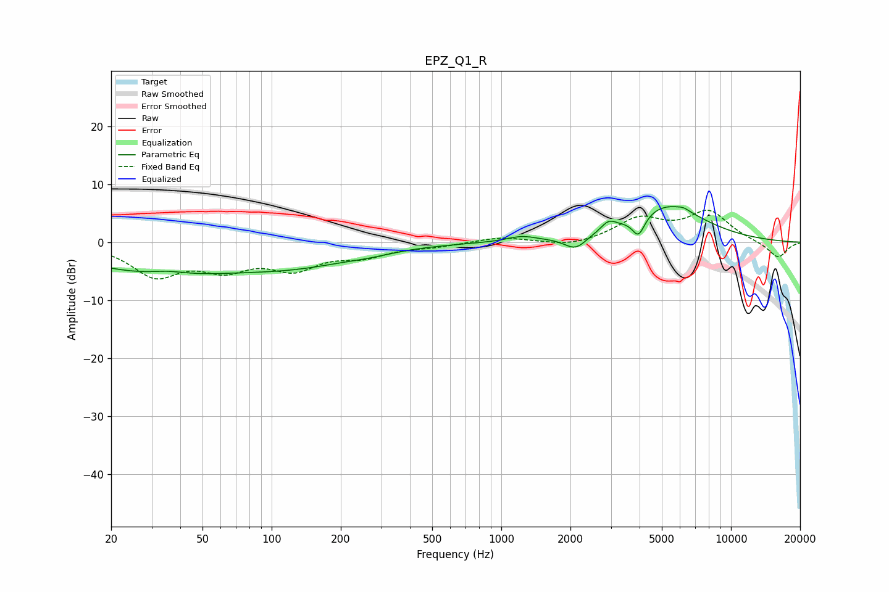

# EPZ_Q1_R
See [usage instructions](https://github.com/jaakkopasanen/AutoEq#usage) for more options and info.

### Parametric EQs
Apply preamp of -6.2 dB when using parametric equalizer.

|   # | Type    |   Fc (Hz) |    Q |   Gain (dB) |
|-----|---------|-----------|------|-------------|
|   1 | Peaking |        32 | 0.43 |        -5.2 |
|   2 | Peaking |        35 | 1.67 |         0.8 |
|   3 | Peaking |       130 | 0.54 |        -3.1 |
|   4 | Peaking |       268 | 1.31 |        -0.5 |
|   5 | Peaking |      1225 | 2.3  |         0.9 |
|   6 | Peaking |      2105 | 2.89 |        -2.3 |
|   7 | Peaking |      2931 | 4.34 |         1.6 |
|   8 | Peaking |      3956 | 5.13 |        -3.5 |
|   9 | Peaking |      5273 | 0.86 |         6.3 |
|  10 | Peaking |      6221 | 6    |         0.4 |

### Fixed Band EQs
When using fixed band (also called graphic) equalizer, apply preamp of **-5.6 dB** (if available) and set gains manually with these parameters.

|   # | Type    |   Fc (Hz) |    Q |   Gain (dB) |
|-----|---------|-----------|------|-------------|
|   1 | Peaking |        31 | 1.41 |        -5.4 |
|   2 | Peaking |        62 | 1.41 |        -3.9 |
|   3 | Peaking |       125 | 1.41 |        -4   |
|   4 | Peaking |       250 | 1.41 |        -2   |
|   5 | Peaking |       500 | 1.41 |        -0.6 |
|   6 | Peaking |      1000 | 1.41 |         0.9 |
|   7 | Peaking |      2000 | 1.41 |        -0.9 |
|   8 | Peaking |      4000 | 1.41 |         3.9 |
|   9 | Peaking |      8000 | 1.41 |         5.1 |
|  10 | Peaking |     16000 | 1.41 |        -2.8 |

### Graphs

