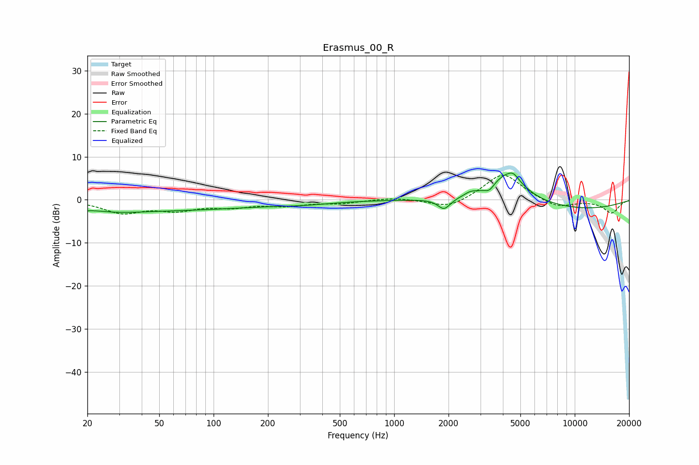

# Erasmus_00_R
See [usage instructions](https://github.com/jaakkopasanen/AutoEq#usage) for more options and info.

### Parametric EQs
Apply preamp of -6.3 dB when using parametric equalizer.

|   # | Type    |   Fc (Hz) |    Q |   Gain (dB) |
|-----|---------|-----------|------|-------------|
|   1 | Peaking |        20 | 0.64 |        -2.8 |
|   2 | Peaking |        22 | 1.6  |         1   |
|   3 | Peaking |        76 | 0.36 |        -1.9 |
|   4 | Peaking |       316 | 0.83 |        -0.6 |
|   5 | Peaking |      1891 | 4.11 |        -2.6 |
|   6 | Peaking |      2638 | 4.46 |         0.7 |
|   7 | Peaking |      3367 | 5.18 |        -1.5 |
|   8 | Peaking |      4221 | 1.41 |         6.8 |
|   9 | Peaking |      4571 | 5.13 |         1.2 |
|  10 | Peaking |     10000 | 0.38 |        -2.3 |

### Fixed Band EQs
When using fixed band (also called graphic) equalizer, apply preamp of **-5.8 dB** (if available) and set gains manually with these parameters.

|   # | Type    |   Fc (Hz) |    Q |   Gain (dB) |
|-----|---------|-----------|------|-------------|
|   1 | Peaking |        31 | 1.41 |        -2.9 |
|   2 | Peaking |        62 | 1.41 |        -2.1 |
|   3 | Peaking |       125 | 1.41 |        -1.4 |
|   4 | Peaking |       250 | 1.41 |        -1.2 |
|   5 | Peaking |       500 | 1.41 |        -0.7 |
|   6 | Peaking |      1000 | 1.41 |         0.6 |
|   7 | Peaking |      2000 | 1.41 |        -2.1 |
|   8 | Peaking |      4000 | 1.41 |         6.4 |
|   9 | Peaking |      8000 | 1.41 |        -2   |
|  10 | Peaking |     16000 | 1.41 |        -3   |

### Graphs

