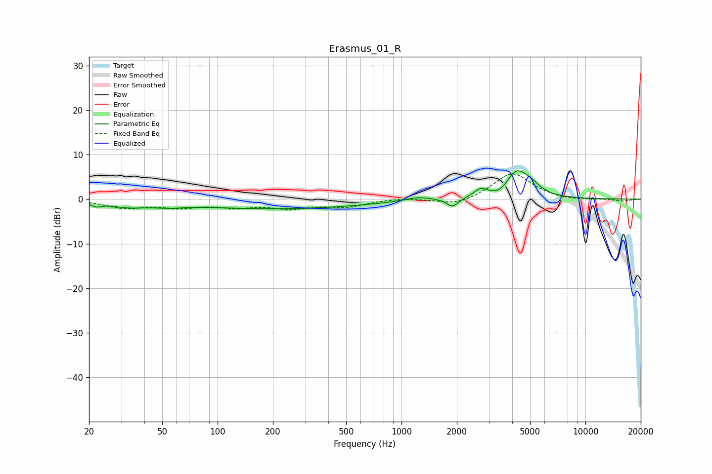

# Erasmus_01_R
See [usage instructions](https://github.com/jaakkopasanen/AutoEq#usage) for more options and info.

### Parametric EQs
Apply preamp of -6.4 dB when using parametric equalizer.

|   # | Type    |   Fc (Hz) |    Q |   Gain (dB) |
|-----|---------|-----------|------|-------------|
|   1 | Peaking |        22 | 5.11 |        -0.8 |
|   2 | Peaking |        32 | 1.26 |        -1.3 |
|   3 | Peaking |        54 | 1.7  |        -0.6 |
|   4 | Peaking |       214 | 0.29 |        -2.1 |
|   5 | Peaking |      1229 | 2.01 |         0.9 |
|   6 | Peaking |      1894 | 4.58 |        -2   |
|   7 | Peaking |      2693 | 3.93 |         1.8 |
|   8 | Peaking |      3490 | 2.93 |        -1.3 |
|   9 | Peaking |      4190 | 2.25 |         6   |
|  10 | Peaking |      5057 | 2.62 |         1.7 |

### Fixed Band EQs
When using fixed band (also called graphic) equalizer, apply preamp of **-5.7 dB** (if available) and set gains manually with these parameters.

|   # | Type    |   Fc (Hz) |    Q |   Gain (dB) |
|-----|---------|-----------|------|-------------|
|   1 | Peaking |        31 | 1.41 |        -1.8 |
|   2 | Peaking |        62 | 1.41 |        -1.5 |
|   3 | Peaking |       125 | 1.41 |        -1.4 |
|   4 | Peaking |       250 | 1.41 |        -1.8 |
|   5 | Peaking |       500 | 1.41 |        -1.5 |
|   6 | Peaking |      1000 | 1.41 |         0.3 |
|   7 | Peaking |      2000 | 1.41 |        -1.5 |
|   8 | Peaking |      4000 | 1.41 |         6   |
|   9 | Peaking |      8000 | 1.41 |        -0.4 |
|  10 | Peaking |     16000 | 1.41 |        -0.5 |

### Graphs

