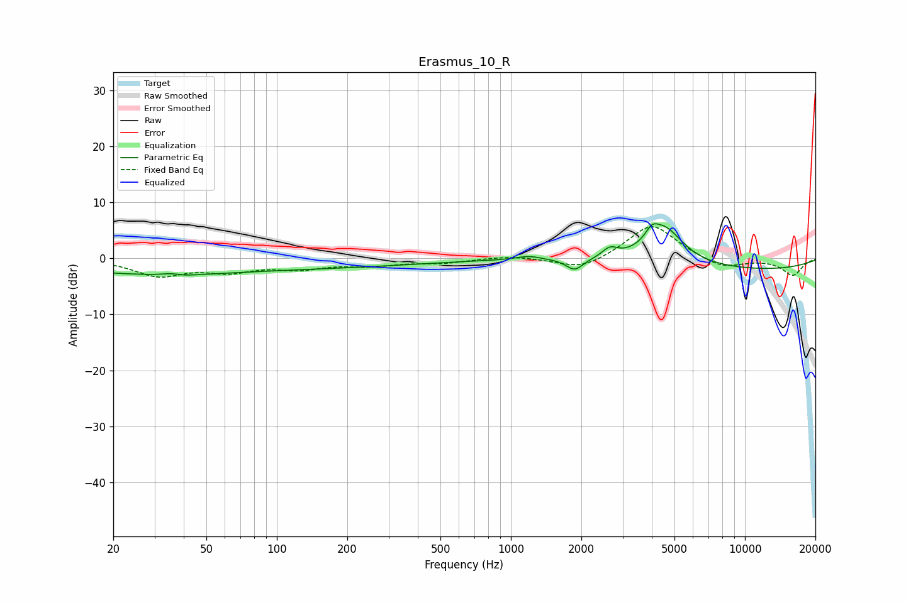

# Erasmus_10_R
See [usage instructions](https://github.com/jaakkopasanen/AutoEq#usage) for more options and info.

### Parametric EQs
Apply preamp of -6.3 dB when using parametric equalizer.

|   # | Type    |   Fc (Hz) |    Q |   Gain (dB) |
|-----|---------|-----------|------|-------------|
|   1 | Peaking |        20 | 0.31 |        -1.5 |
|   2 | Peaking |        36 | 2.92 |         2.2 |
|   3 | Peaking |        36 | 2.58 |        -2.1 |
|   4 | Peaking |        84 | 0.19 |        -1.7 |
|   5 | Peaking |      1188 | 2.63 |         0.7 |
|   6 | Peaking |      1873 | 3.9  |        -2.1 |
|   7 | Peaking |      2650 | 4.37 |         1.7 |
|   8 | Peaking |      4000 | 5.15 |         1.8 |
|   9 | Peaking |      4521 | 1.71 |         6.6 |
|  10 | Peaking |     10000 | 0.3  |        -2.1 |

### Fixed Band EQs
When using fixed band (also called graphic) equalizer, apply preamp of **-5.7 dB** (if available) and set gains manually with these parameters.

|   # | Type    |   Fc (Hz) |    Q |   Gain (dB) |
|-----|---------|-----------|------|-------------|
|   1 | Peaking |        31 | 1.41 |        -2.9 |
|   2 | Peaking |        62 | 1.41 |        -2   |
|   3 | Peaking |       125 | 1.41 |        -1.5 |
|   4 | Peaking |       250 | 1.41 |        -1.1 |
|   5 | Peaking |       500 | 1.41 |        -0.7 |
|   6 | Peaking |      1000 | 1.41 |         0.5 |
|   7 | Peaking |      2000 | 1.41 |        -2.2 |
|   8 | Peaking |      4000 | 1.41 |         6.3 |
|   9 | Peaking |      8000 | 1.41 |        -1.9 |
|  10 | Peaking |     16000 | 1.41 |        -3   |

### Graphs

