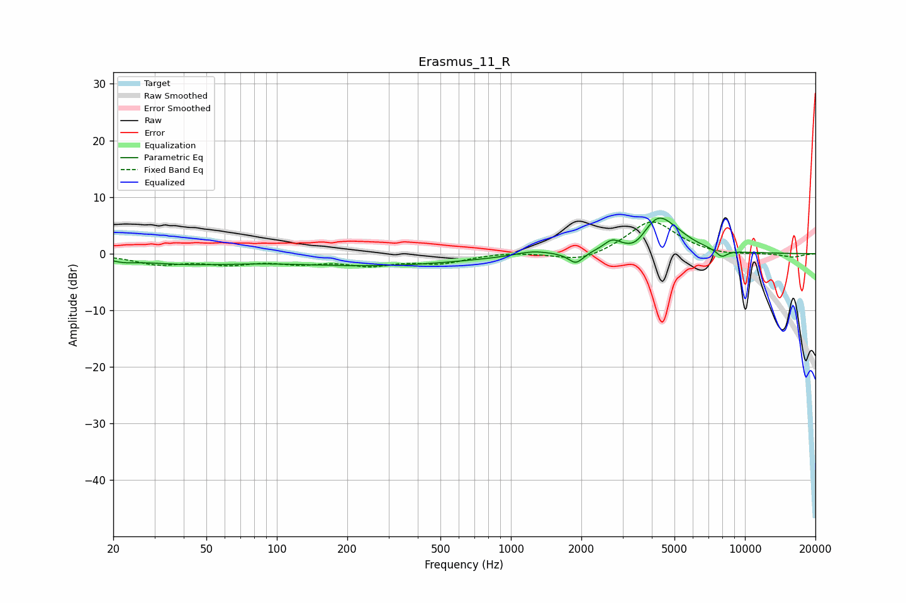

# Erasmus_11_R
See [usage instructions](https://github.com/jaakkopasanen/AutoEq#usage) for more options and info.

### Parametric EQs
Apply preamp of -6.4 dB when using parametric equalizer.

|   # | Type    |   Fc (Hz) |    Q |   Gain (dB) |
|-----|---------|-----------|------|-------------|
|   1 | Peaking |        22 | 2.85 |        -0.5 |
|   2 | Peaking |        41 | 0.61 |        -1.6 |
|   3 | Peaking |       263 | 0.36 |        -2   |
|   4 | Peaking |      1235 | 1.93 |         0.8 |
|   5 | Peaking |      1896 | 4.48 |        -2   |
|   6 | Peaking |      2706 | 3.93 |         1.7 |
|   7 | Peaking |      3418 | 2.99 |        -1.7 |
|   8 | Peaking |      4232 | 1.98 |         5.8 |
|   9 | Peaking |      5081 | 1.69 |         1.3 |
|  10 | Peaking |      7957 | 5.38 |        -1.3 |

### Fixed Band EQs
When using fixed band (also called graphic) equalizer, apply preamp of **-5.7 dB** (if available) and set gains manually with these parameters.

|   # | Type    |   Fc (Hz) |    Q |   Gain (dB) |
|-----|---------|-----------|------|-------------|
|   1 | Peaking |        31 | 1.41 |        -1.7 |
|   2 | Peaking |        62 | 1.41 |        -1.5 |
|   3 | Peaking |       125 | 1.41 |        -1.4 |
|   4 | Peaking |       250 | 1.41 |        -1.8 |
|   5 | Peaking |       500 | 1.41 |        -1.5 |
|   6 | Peaking |      1000 | 1.41 |         0.3 |
|   7 | Peaking |      2000 | 1.41 |        -1.6 |
|   8 | Peaking |      4000 | 1.41 |         5.9 |
|   9 | Peaking |      8000 | 1.41 |        -0.5 |
|  10 | Peaking |     16000 | 1.41 |        -0.6 |

### Graphs

