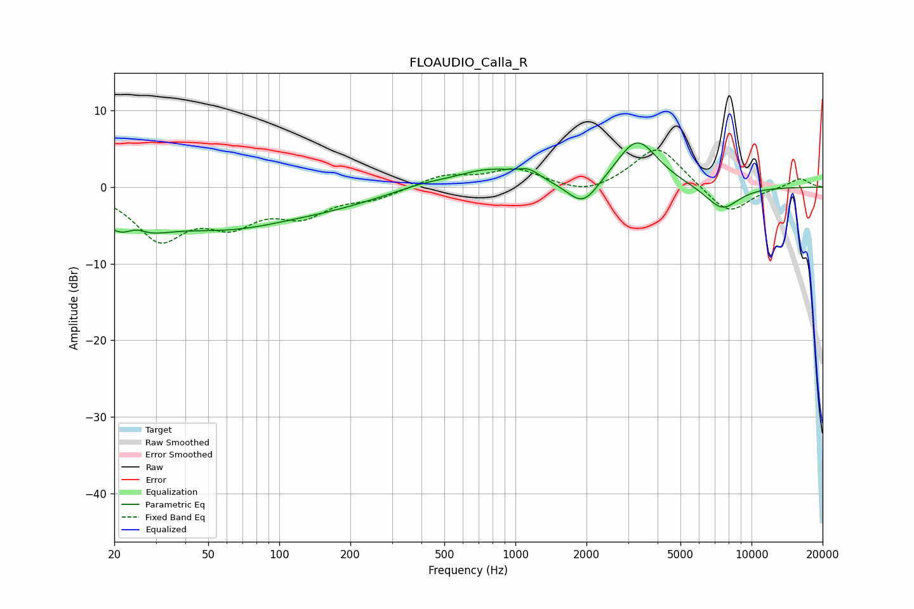

# FLOAUDIO_Calla_R
See [usage instructions](https://github.com/jaakkopasanen/AutoEq#usage) for more options and info.

### Parametric EQs
Apply preamp of -5.9 dB when using parametric equalizer.

|   # | Type    |   Fc (Hz) |    Q |   Gain (dB) |
|-----|---------|-----------|------|-------------|
|   1 | Peaking |        23 | 1.32 |        -5.6 |
|   2 | Peaking |        25 | 2.71 |         2.5 |
|   3 | Peaking |        60 | 0.46 |        -4.8 |
|   4 | Peaking |       177 | 0.68 |        -1.1 |
|   5 | Peaking |       400 | 1.37 |         0.5 |
|   6 | Peaking |       776 | 0.95 |         2.3 |
|   7 | Peaking |      1142 | 3.01 |         1.1 |
|   8 | Peaking |      1936 | 2.11 |        -3.5 |
|   9 | Peaking |      3276 | 1.58 |         6.4 |
|  10 | Peaking |      7508 | 1.84 |        -3.1 |

### Fixed Band EQs
When using fixed band (also called graphic) equalizer, apply preamp of **-4.9 dB** (if available) and set gains manually with these parameters.

|   # | Type    |   Fc (Hz) |    Q |   Gain (dB) |
|-----|---------|-----------|------|-------------|
|   1 | Peaking |        31 | 1.41 |        -6.4 |
|   2 | Peaking |        62 | 1.41 |        -4   |
|   3 | Peaking |       125 | 1.41 |        -3.2 |
|   4 | Peaking |       250 | 1.41 |        -1.3 |
|   5 | Peaking |       500 | 1.41 |         1.5 |
|   6 | Peaking |      1000 | 1.41 |         2.2 |
|   7 | Peaking |      2000 | 1.41 |        -1.2 |
|   8 | Peaking |      4000 | 1.41 |         5.5 |
|   9 | Peaking |      8000 | 1.41 |        -3.7 |
|  10 | Peaking |     16000 | 1.41 |         1.2 |

### Graphs

