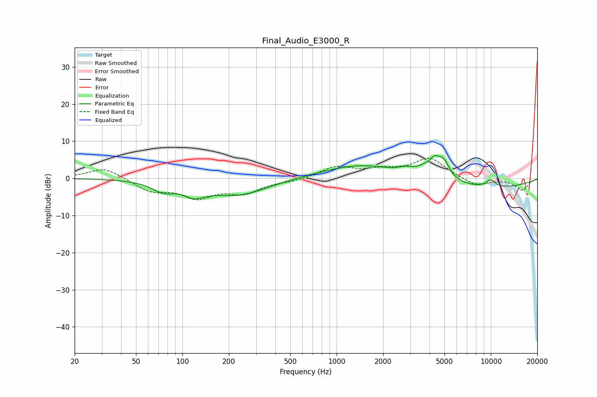

# Final_Audio_E3000_R
See [usage instructions](https://github.com/jaakkopasanen/AutoEq#usage) for more options and info.

### Parametric EQs
Apply preamp of -6.2 dB when using parametric equalizer.

|   # | Type    |   Fc (Hz) |    Q |   Gain (dB) |
|-----|---------|-----------|------|-------------|
|   1 | Peaking |        75 | 1.86 |        -2.6 |
|   2 | Peaking |       119 | 2.12 |        -2.7 |
|   3 | Peaking |       227 | 0.72 |        -4.5 |
|   4 | Peaking |      1536 | 0.54 |         4.8 |
|   5 | Peaking |      2808 | 2.68 |         1.2 |
|   6 | Peaking |      4000 | 4.89 |        -1.6 |
|   7 | Peaking |      4206 | 2.38 |         7.2 |
|   8 | Peaking |      4985 | 4.09 |         3   |
|   9 | Peaking |      6529 | 0.23 |        -3.1 |
|  10 | Peaking |      9967 | 4.13 |         2   |

### Fixed Band EQs
When using fixed band (also called graphic) equalizer, apply preamp of **-5.5 dB** (if available) and set gains manually with these parameters.

|   # | Type    |   Fc (Hz) |    Q |   Gain (dB) |
|-----|---------|-----------|------|-------------|
|   1 | Peaking |        31 | 1.41 |         3   |
|   2 | Peaking |        62 | 1.41 |        -3.2 |
|   3 | Peaking |       125 | 1.41 |        -4.7 |
|   4 | Peaking |       250 | 1.41 |        -3.5 |
|   5 | Peaking |       500 | 1.41 |        -0.7 |
|   6 | Peaking |      1000 | 1.41 |         3   |
|   7 | Peaking |      2000 | 1.41 |         1.8 |
|   8 | Peaking |      4000 | 1.41 |         5.3 |
|   9 | Peaking |      8000 | 1.41 |        -2.2 |
|  10 | Peaking |     16000 | 1.41 |        -3.2 |

### Graphs

