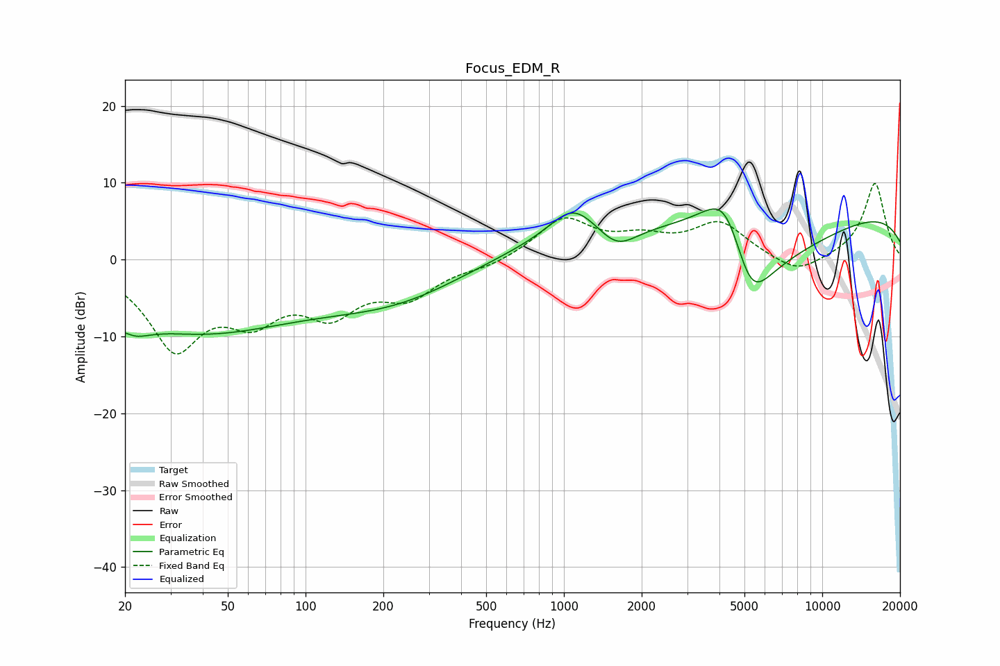

# Focus_EDM_R
See [usage instructions](https://github.com/jaakkopasanen/AutoEq#usage) for more options and info.

### Parametric EQs
Apply preamp of -6.7 dB when using parametric equalizer.

|   # | Type    |   Fc (Hz) |    Q |   Gain (dB) |
|-----|---------|-----------|------|-------------|
|   1 | Peaking |        20 | 2.19 |        -4.6 |
|   2 | Peaking |        20 | 3.56 |         2.1 |
|   3 | Peaking |        39 | 0.35 |        -8.8 |
|   4 | Peaking |       231 | 0.48 |        -4.8 |
|   5 | Peaking |      1087 | 1.54 |         4.3 |
|   6 | Peaking |      1235 | 0.31 |         3.1 |
|   7 | Peaking |      1606 | 1.86 |        -2.9 |
|   8 | Peaking |      4254 | 1.15 |        13.9 |
|   9 | Peaking |      5253 | 0.89 |       -20   |
|  10 | Peaking |     10000 | 0.18 |         7.1 |

### Fixed Band EQs
When using fixed band (also called graphic) equalizer, apply preamp of **-10.0 dB** (if available) and set gains manually with these parameters.

|   # | Type    |   Fc (Hz) |    Q |   Gain (dB) |
|-----|---------|-----------|------|-------------|
|   1 | Peaking |        31 | 1.41 |       -10.9 |
|   2 | Peaking |        62 | 1.41 |        -6   |
|   3 | Peaking |       125 | 1.41 |        -5.9 |
|   4 | Peaking |       250 | 1.41 |        -4.2 |
|   5 | Peaking |       500 | 1.41 |        -0.9 |
|   6 | Peaking |      1000 | 1.41 |         5.2 |
|   7 | Peaking |      2000 | 1.41 |         2.2 |
|   8 | Peaking |      4000 | 1.41 |         4.6 |
|   9 | Peaking |      8000 | 1.41 |        -2.2 |
|  10 | Peaking |     16000 | 1.41 |        10   |

### Graphs

