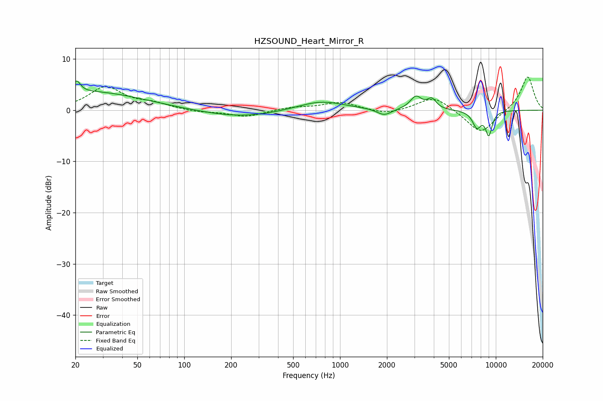

# HZSOUND_Heart_Mirror_R
See [usage instructions](https://github.com/jaakkopasanen/AutoEq#usage) for more options and info.

### Parametric EQs
Apply preamp of -5.8 dB when using parametric equalizer.

|   # | Type    |   Fc (Hz) |    Q |   Gain (dB) |
|-----|---------|-----------|------|-------------|
|   1 | Peaking |        20 | 6    |         2.2 |
|   2 | Peaking |        25 | 0.42 |         3.6 |
|   3 | Peaking |       229 | 0.59 |        -1.4 |
|   4 | Peaking |       752 | 0.94 |         1.9 |
|   5 | Peaking |      1923 | 3.05 |        -1.3 |
|   6 | Peaking |      2704 | 5.26 |        -0   |
|   7 | Peaking |      3070 | 3.72 |         2.5 |
|   8 | Peaking |      3883 | 4.96 |         1.9 |
|   9 | Peaking |      7557 | 4.74 |        -3.1 |
|  10 | Peaking |      9016 | 6    |        -4.5 |

### Fixed Band EQs
When using fixed band (also called graphic) equalizer, apply preamp of **-6.6 dB** (if available) and set gains manually with these parameters.

|   # | Type    |   Fc (Hz) |    Q |   Gain (dB) |
|-----|---------|-----------|------|-------------|
|   1 | Peaking |        31 | 1.41 |         4.4 |
|   2 | Peaking |        62 | 1.41 |         1.1 |
|   3 | Peaking |       125 | 1.41 |        -0.4 |
|   4 | Peaking |       250 | 1.41 |        -1.3 |
|   5 | Peaking |       500 | 1.41 |         0.5 |
|   6 | Peaking |      1000 | 1.41 |         1.5 |
|   7 | Peaking |      2000 | 1.41 |        -0.9 |
|   8 | Peaking |      4000 | 1.41 |         2.8 |
|   9 | Peaking |      8000 | 1.41 |        -4.7 |
|  10 | Peaking |     16000 | 1.41 |         6.7 |

### Graphs

