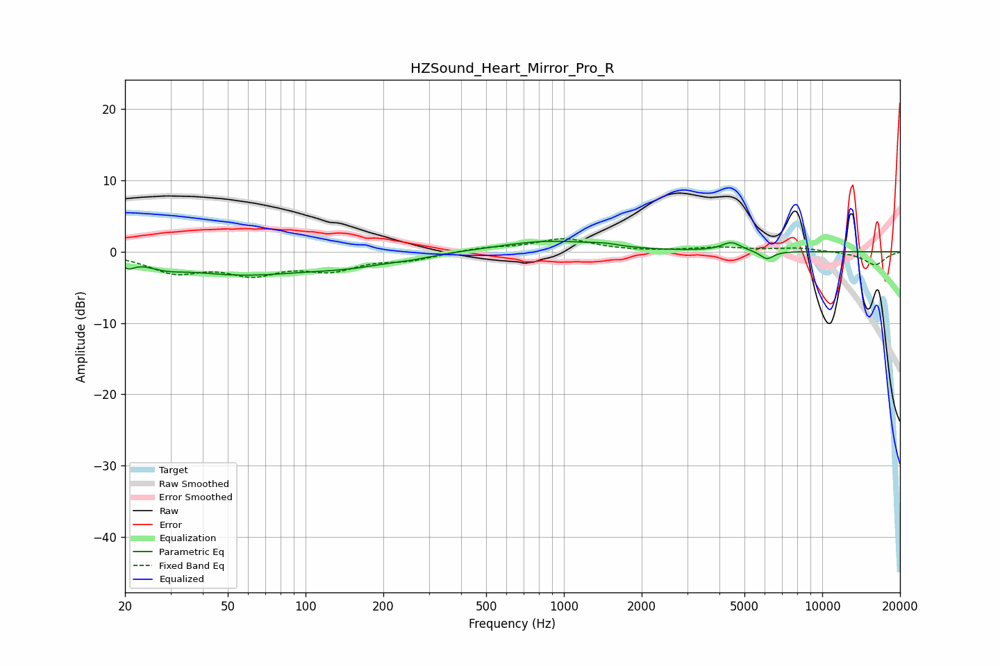

# HZSound_Heart_Mirror_Pro_R
See [usage instructions](https://github.com/jaakkopasanen/AutoEq#usage) for more options and info.

### Parametric EQs
Apply preamp of -1.6 dB when using parametric equalizer.

|   # | Type    |   Fc (Hz) |    Q |   Gain (dB) |
|-----|---------|-----------|------|-------------|
|   1 | Peaking |        21 | 5.97 |        -1.1 |
|   2 | Peaking |        29 | 1.94 |        -0.9 |
|   3 | Peaking |        56 | 0.64 |        -3.3 |
|   4 | Peaking |        58 | 1.05 |         0.4 |
|   5 | Peaking |       148 | 0.82 |        -1.4 |
|   6 | Peaking |       258 | 1.9  |        -0.3 |
|   7 | Peaking |       865 | 0.76 |         1.5 |
|   8 | Peaking |      1430 | 2.57 |         0.3 |
|   9 | Peaking |      4445 | 3.76 |         1.3 |
|  10 | Peaking |      6107 | 5.29 |        -1.2 |

### Fixed Band EQs
When using fixed band (also called graphic) equalizer, apply preamp of **-1.9 dB** (if available) and set gains manually with these parameters.

|   # | Type    |   Fc (Hz) |    Q |   Gain (dB) |
|-----|---------|-----------|------|-------------|
|   1 | Peaking |        31 | 1.41 |        -2.6 |
|   2 | Peaking |        62 | 1.41 |        -2.7 |
|   3 | Peaking |       125 | 1.41 |        -2.2 |
|   4 | Peaking |       250 | 1.41 |        -1   |
|   5 | Peaking |       500 | 1.41 |         0.5 |
|   6 | Peaking |      1000 | 1.41 |         1.8 |
|   7 | Peaking |      2000 | 1.41 |        -0   |
|   8 | Peaking |      4000 | 1.41 |         0.6 |
|   9 | Peaking |      8000 | 1.41 |         0.5 |
|  10 | Peaking |     16000 | 1.41 |        -1.9 |

### Graphs

