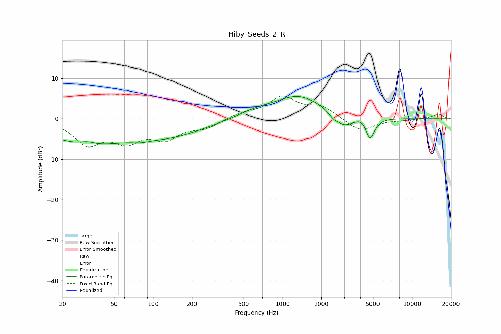

# Hiby_Seeds_2_R
See [usage instructions](https://github.com/jaakkopasanen/AutoEq#usage) for more options and info.

### Parametric EQs
Apply preamp of -5.6 dB when using parametric equalizer.

|   # | Type    |   Fc (Hz) |    Q |   Gain (dB) |
|-----|---------|-----------|------|-------------|
|   1 | Peaking |        30 | 0.46 |        -5.9 |
|   2 | Peaking |        31 | 2.5  |         0.9 |
|   3 | Peaking |        80 | 2.23 |        -0.5 |
|   4 | Peaking |       137 | 0.53 |        -3.6 |
|   5 | Peaking |       603 | 1.09 |         1.3 |
|   6 | Peaking |      1329 | 0.74 |         5.6 |
|   7 | Peaking |      2464 | 4.69 |        -1   |
|   8 | Peaking |      2981 | 2.05 |        -3   |
|   9 | Peaking |      4124 | 3.93 |         0.9 |
|  10 | Peaking |      4751 | 4.08 |        -5.2 |

### Fixed Band EQs
When using fixed band (also called graphic) equalizer, apply preamp of **-5.7 dB** (if available) and set gains manually with these parameters.

|   # | Type    |   Fc (Hz) |    Q |   Gain (dB) |
|-----|---------|-----------|------|-------------|
|   1 | Peaking |        31 | 1.41 |        -5.9 |
|   2 | Peaking |        62 | 1.41 |        -4.8 |
|   3 | Peaking |       125 | 1.41 |        -4.3 |
|   4 | Peaking |       250 | 1.41 |        -2   |
|   5 | Peaking |       500 | 1.41 |         1.3 |
|   6 | Peaking |      1000 | 1.41 |         5.1 |
|   7 | Peaking |      2000 | 1.41 |         2.8 |
|   8 | Peaking |      4000 | 1.41 |        -3.2 |
|   9 | Peaking |      8000 | 1.41 |        -0.3 |
|  10 | Peaking |     16000 | 1.41 |         1.2 |

### Graphs

