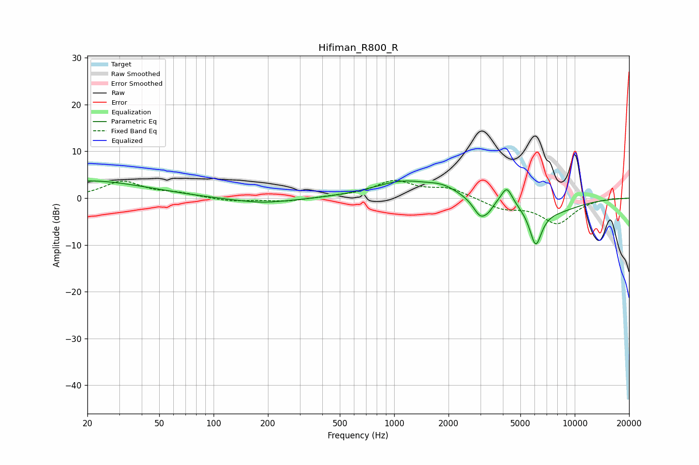

# Hifiman_R800_R
See [usage instructions](https://github.com/jaakkopasanen/AutoEq#usage) for more options and info.

### Parametric EQs
Apply preamp of -3.8 dB when using parametric equalizer.

|   # | Type    |   Fc (Hz) |    Q |   Gain (dB) |
|-----|---------|-----------|------|-------------|
|   1 | Peaking |        20 | 0.43 |         3.7 |
|   2 | Peaking |       185 | 0.73 |        -1.1 |
|   3 | Peaking |       188 | 3.06 |        -0.1 |
|   4 | Peaking |      1120 | 0.85 |         3.5 |
|   5 | Peaking |      1855 | 1.74 |         1.5 |
|   6 | Peaking |      3018 | 3.38 |        -4.2 |
|   7 | Peaking |      3351 | 6    |        -0.9 |
|   8 | Peaking |      4203 | 4.53 |         3.8 |
|   9 | Peaking |      6077 | 3.96 |        -8.1 |
|  10 | Peaking |      7698 | 0.88 |        -2.5 |

### Fixed Band EQs
When using fixed band (also called graphic) equalizer, apply preamp of **-3.9 dB** (if available) and set gains manually with these parameters.

|   # | Type    |   Fc (Hz) |    Q |   Gain (dB) |
|-----|---------|-----------|------|-------------|
|   1 | Peaking |        31 | 1.41 |         3.5 |
|   2 | Peaking |        62 | 1.41 |         0.9 |
|   3 | Peaking |       125 | 1.41 |        -0.7 |
|   4 | Peaking |       250 | 1.41 |        -0.7 |
|   5 | Peaking |       500 | 1.41 |         0.3 |
|   6 | Peaking |      1000 | 1.41 |         3.5 |
|   7 | Peaking |      2000 | 1.41 |         2   |
|   8 | Peaking |      4000 | 1.41 |        -2.1 |
|   9 | Peaking |      8000 | 1.41 |        -5.2 |
|  10 | Peaking |     16000 | 1.41 |         0.1 |

### Graphs

