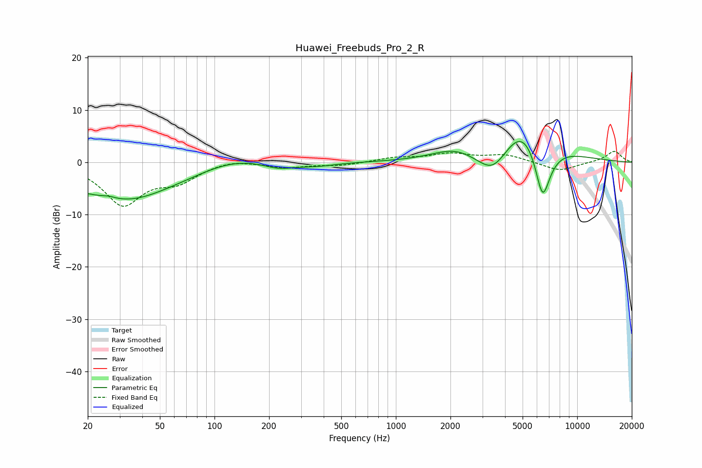

# Huawei_Freebuds_Pro_2_R
See [usage instructions](https://github.com/jaakkopasanen/AutoEq#usage) for more options and info.

### Parametric EQs
Apply preamp of -4.1 dB when using parametric equalizer.

|   # | Type    |   Fc (Hz) |    Q |   Gain (dB) |
|-----|---------|-----------|------|-------------|
|   1 | Peaking |        26 | 4.27 |         0.4 |
|   2 | Peaking |        31 | 0.25 |        -5.2 |
|   3 | Peaking |        34 | 0.82 |        -2.4 |
|   4 | Peaking |       122 | 0.66 |         2.9 |
|   5 | Peaking |       226 | 1.57 |        -1.3 |
|   6 | Peaking |       369 | 1.31 |        -0.6 |
|   7 | Peaking |      2094 | 1.18 |         1.9 |
|   8 | Peaking |      3447 | 1.48 |        -6.2 |
|   9 | Peaking |      5096 | 0.93 |        10   |
|  10 | Peaking |      6441 | 2.76 |       -12.5 |

### Fixed Band EQs
When using fixed band (also called graphic) equalizer, apply preamp of **-2.2 dB** (if available) and set gains manually with these parameters.

|   # | Type    |   Fc (Hz) |    Q |   Gain (dB) |
|-----|---------|-----------|------|-------------|
|   1 | Peaking |        31 | 1.41 |        -7.9 |
|   2 | Peaking |        62 | 1.41 |        -3.1 |
|   3 | Peaking |       125 | 1.41 |         0.7 |
|   4 | Peaking |       250 | 1.41 |        -0.9 |
|   5 | Peaking |       500 | 1.41 |        -0.6 |
|   6 | Peaking |      1000 | 1.41 |         0.8 |
|   7 | Peaking |      2000 | 1.41 |         1.5 |
|   8 | Peaking |      4000 | 1.41 |         1.4 |
|   9 | Peaking |      8000 | 1.41 |        -1.7 |
|  10 | Peaking |     16000 | 1.41 |         2.2 |

### Graphs

