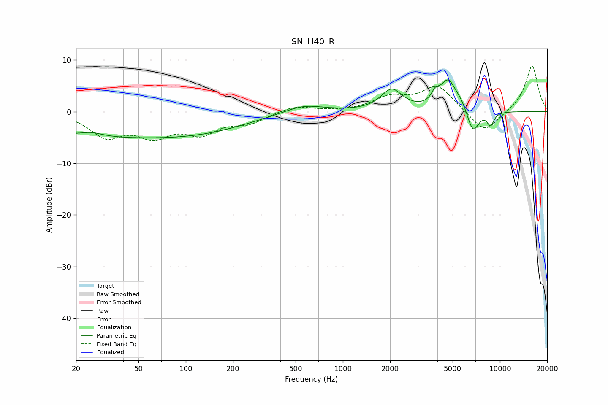

# ISN_H40_R
See [usage instructions](https://github.com/jaakkopasanen/AutoEq#usage) for more options and info.

### Parametric EQs
Apply preamp of -6.3 dB when using parametric equalizer.

|   # | Type    |   Fc (Hz) |    Q |   Gain (dB) |
|-----|---------|-----------|------|-------------|
|   1 | Peaking |        25 | 2.13 |         0.8 |
|   2 | Peaking |        30 | 0.25 |        -4.6 |
|   3 | Peaking |       147 | 0.48 |        -2.2 |
|   4 | Peaking |       560 | 1.08 |         1.7 |
|   5 | Peaking |      2044 | 2.12 |         4.1 |
|   6 | Peaking |      3876 | 5.72 |         1.8 |
|   7 | Peaking |      4687 | 2.67 |         5.8 |
|   8 | Peaking |      5677 | 3.86 |         1.1 |
|   9 | Peaking |      6735 | 3.6  |        -4.6 |
|  10 | Peaking |      8719 | 5.9  |        -2.5 |

### Fixed Band EQs
When using fixed band (also called graphic) equalizer, apply preamp of **-8.9 dB** (if available) and set gains manually with these parameters.

|   # | Type    |   Fc (Hz) |    Q |   Gain (dB) |
|-----|---------|-----------|------|-------------|
|   1 | Peaking |        31 | 1.41 |        -4.5 |
|   2 | Peaking |        62 | 1.41 |        -4.1 |
|   3 | Peaking |       125 | 1.41 |        -3.7 |
|   4 | Peaking |       250 | 1.41 |        -2   |
|   5 | Peaking |       500 | 1.41 |         1.2 |
|   6 | Peaking |      1000 | 1.41 |        -0   |
|   7 | Peaking |      2000 | 1.41 |         2.5 |
|   8 | Peaking |      4000 | 1.41 |         5   |
|   9 | Peaking |      8000 | 1.41 |        -4.4 |
|  10 | Peaking |     16000 | 1.41 |         9   |

### Graphs

