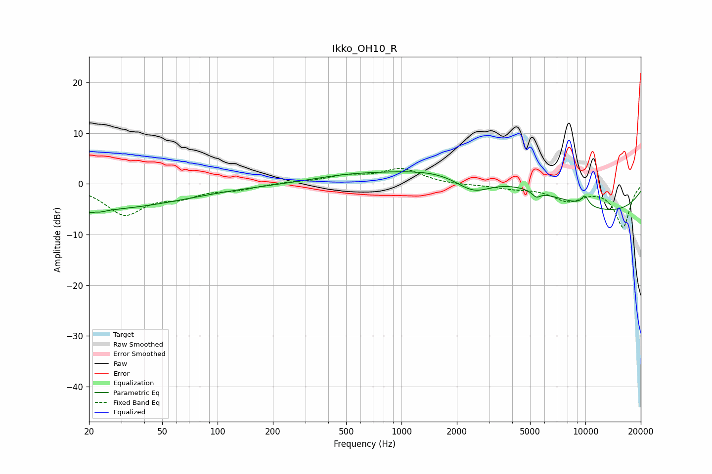

# Ikko_OH10_R
See [usage instructions](https://github.com/jaakkopasanen/AutoEq#usage) for more options and info.

### Parametric EQs
Apply preamp of -2.5 dB when using parametric equalizer.

|   # | Type    |   Fc (Hz) |    Q |   Gain (dB) |
|-----|---------|-----------|------|-------------|
|   1 | Peaking |        20 | 0.29 |        -5   |
|   2 | Peaking |        22 | 5.05 |        -3.8 |
|   3 | Peaking |        22 | 5.87 |         3.2 |
|   4 | Peaking |       154 | 0.23 |        -0.3 |
|   5 | Peaking |       497 | 0.65 |         1.3 |
|   6 | Peaking |      2458 | 1.37 |        -3.7 |
|   7 | Peaking |      3098 | 0.32 |         5.5 |
|   8 | Peaking |      5401 | 6    |        -1.2 |
|   9 | Peaking |      9938 | 6    |         2   |
|  10 | Peaking |     10000 | 0.25 |        -6.7 |

### Fixed Band EQs
When using fixed band (also called graphic) equalizer, apply preamp of **-3.1 dB** (if available) and set gains manually with these parameters.

|   # | Type    |   Fc (Hz) |    Q |   Gain (dB) |
|-----|---------|-----------|------|-------------|
|   1 | Peaking |        31 | 1.41 |        -5.8 |
|   2 | Peaking |        62 | 1.41 |        -2.1 |
|   3 | Peaking |       125 | 1.41 |        -1   |
|   4 | Peaking |       250 | 1.41 |         0.3 |
|   5 | Peaking |       500 | 1.41 |         1.4 |
|   6 | Peaking |      1000 | 1.41 |         2.9 |
|   7 | Peaking |      2000 | 1.41 |        -0.2 |
|   8 | Peaking |      4000 | 1.41 |        -0.7 |
|   9 | Peaking |      8000 | 1.41 |        -3   |
|  10 | Peaking |     16000 | 1.41 |        -8.4 |

### Graphs

