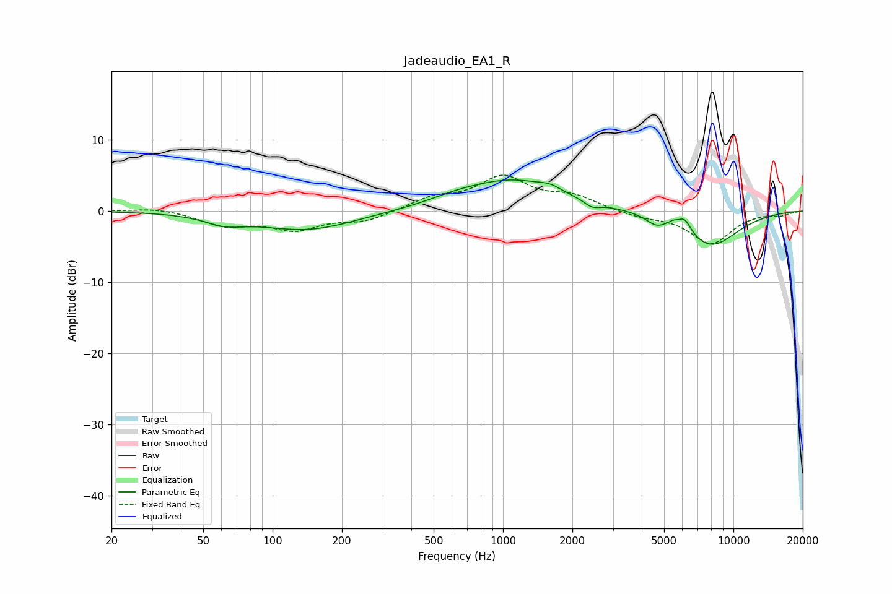

# Jadeaudio_EA1_R
See [usage instructions](https://github.com/jaakkopasanen/AutoEq#usage) for more options and info.

### Parametric EQs
Apply preamp of -4.4 dB when using parametric equalizer.

|   # | Type    |   Fc (Hz) |    Q |   Gain (dB) |
|-----|---------|-----------|------|-------------|
|   1 | Peaking |        62 | 1.68 |        -1.2 |
|   2 | Peaking |       141 | 0.68 |        -2.7 |
|   3 | Peaking |       621 | 1.21 |         0.6 |
|   4 | Peaking |      1108 | 0.66 |         4.2 |
|   5 | Peaking |      1600 | 3.19 |         0.6 |
|   6 | Peaking |      2436 | 3.95 |        -0.9 |
|   7 | Peaking |      4604 | 3.5  |        -1.1 |
|   8 | Peaking |      5486 | 5.89 |         0.6 |
|   9 | Peaking |      6140 | 4.94 |         1.9 |
|  10 | Peaking |      7942 | 1.07 |        -5   |

### Fixed Band EQs
When using fixed band (also called graphic) equalizer, apply preamp of **-5.1 dB** (if available) and set gains manually with these parameters.

|   # | Type    |   Fc (Hz) |    Q |   Gain (dB) |
|-----|---------|-----------|------|-------------|
|   1 | Peaking |        31 | 1.41 |         0.5 |
|   2 | Peaking |        62 | 1.41 |        -1.9 |
|   3 | Peaking |       125 | 1.41 |        -2.4 |
|   4 | Peaking |       250 | 1.41 |        -1.4 |
|   5 | Peaking |       500 | 1.41 |         1.7 |
|   6 | Peaking |      1000 | 1.41 |         4.5 |
|   7 | Peaking |      2000 | 1.41 |         1.8 |
|   8 | Peaking |      4000 | 1.41 |        -0.8 |
|   9 | Peaking |      8000 | 1.41 |        -4.5 |
|  10 | Peaking |     16000 | 1.41 |        -0.5 |

### Graphs

