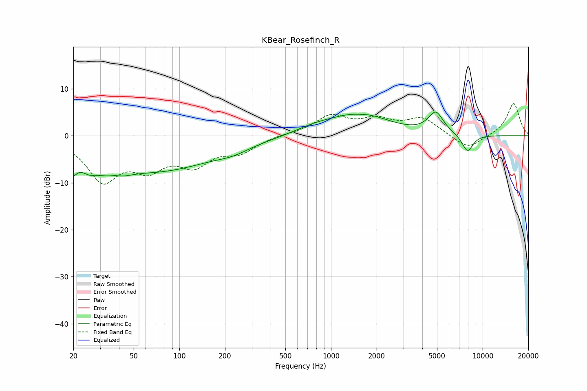

# KBear_Rosefinch_R
See [usage instructions](https://github.com/jaakkopasanen/AutoEq#usage) for more options and info.

### Parametric EQs
Apply preamp of -5.1 dB when using parametric equalizer.

|   # | Type    |   Fc (Hz) |    Q |   Gain (dB) |
|-----|---------|-----------|------|-------------|
|   1 | Peaking |        20 | 1.13 |        -8.3 |
|   2 | Peaking |        22 | 3.07 |         3.3 |
|   3 | Peaking |        42 | 2.14 |        -0.9 |
|   4 | Peaking |        74 | 0.37 |        -7   |
|   5 | Peaking |       226 | 1.36 |        -1   |
|   6 | Peaking |       785 | 1.02 |         1.3 |
|   7 | Peaking |      1542 | 2.12 |        -0.4 |
|   8 | Peaking |      1551 | 0.77 |         4.7 |
|   9 | Peaking |      4914 | 2.79 |         4.5 |
|  10 | Peaking |      7944 | 3.51 |        -3.8 |

### Fixed Band EQs
When using fixed band (also called graphic) equalizer, apply preamp of **-7.0 dB** (if available) and set gains manually with these parameters.

|   # | Type    |   Fc (Hz) |    Q |   Gain (dB) |
|-----|---------|-----------|------|-------------|
|   1 | Peaking |        31 | 1.41 |        -9   |
|   2 | Peaking |        62 | 1.41 |        -5.6 |
|   3 | Peaking |       125 | 1.41 |        -5.3 |
|   4 | Peaking |       250 | 1.41 |        -3.1 |
|   5 | Peaking |       500 | 1.41 |         0.3 |
|   6 | Peaking |      1000 | 1.41 |         4   |
|   7 | Peaking |      2000 | 1.41 |         2.9 |
|   8 | Peaking |      4000 | 1.41 |         3.5 |
|   9 | Peaking |      8000 | 1.41 |        -3   |
|  10 | Peaking |     16000 | 1.41 |         7   |

### Graphs

