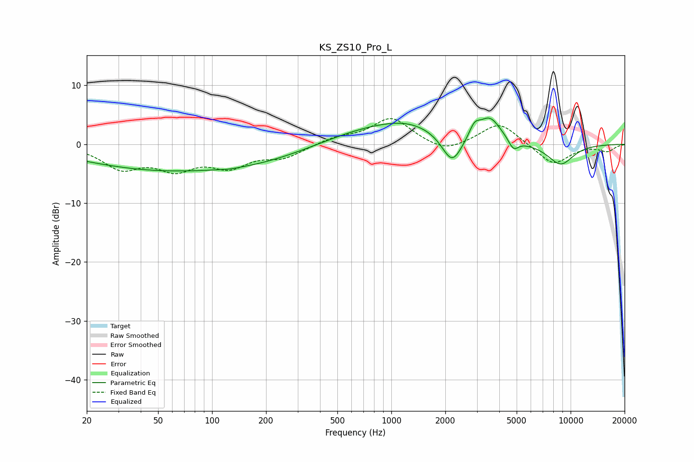

# KS_ZS10_Pro_L
See [usage instructions](https://github.com/jaakkopasanen/AutoEq#usage) for more options and info.

### Parametric EQs
Apply preamp of -4.5 dB when using parametric equalizer.

|   # | Type    |   Fc (Hz) |    Q |   Gain (dB) |
|-----|---------|-----------|------|-------------|
|   1 | Peaking |        56 | 0.29 |        -4.4 |
|   2 | Peaking |       126 | 2.48 |        -0.2 |
|   3 | Peaking |       205 | 0.62 |        -1   |
|   4 | Peaking |       640 | 0.69 |         1.4 |
|   5 | Peaking |      1240 | 0.71 |         3.3 |
|   6 | Peaking |      2182 | 2.49 |        -5.2 |
|   7 | Peaking |      2907 | 4.81 |         2   |
|   8 | Peaking |      3538 | 2.24 |         4.2 |
|   9 | Peaking |      4800 | 5.07 |        -1.8 |
|  10 | Peaking |      8782 | 1.75 |        -3.5 |

### Fixed Band EQs
When using fixed band (also called graphic) equalizer, apply preamp of **-4.4 dB** (if available) and set gains manually with these parameters.

|   # | Type    |   Fc (Hz) |    Q |   Gain (dB) |
|-----|---------|-----------|------|-------------|
|   1 | Peaking |        31 | 1.41 |        -3.8 |
|   2 | Peaking |        62 | 1.41 |        -3.6 |
|   3 | Peaking |       125 | 1.41 |        -3.3 |
|   4 | Peaking |       250 | 1.41 |        -2   |
|   5 | Peaking |       500 | 1.41 |         1.1 |
|   6 | Peaking |      1000 | 1.41 |         4.5 |
|   7 | Peaking |      2000 | 1.41 |        -1.7 |
|   8 | Peaking |      4000 | 1.41 |         3.8 |
|   9 | Peaking |      8000 | 1.41 |        -3.6 |
|  10 | Peaking |     16000 | 1.41 |        -1.1 |

### Graphs

