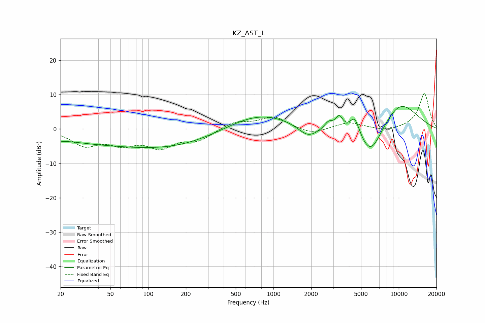

# KZ_AST_L
See [usage instructions](https://github.com/jaakkopasanen/AutoEq#usage) for more options and info.

### Parametric EQs
Apply preamp of -6.7 dB when using parametric equalizer.

|   # | Type    |   Fc (Hz) |    Q |   Gain (dB) |
|-----|---------|-----------|------|-------------|
|   1 | Peaking |        20 | 4.79 |        -0.3 |
|   2 | Peaking |        80 | 0.18 |        -4.6 |
|   3 | Peaking |       154 | 0.44 |        -1.4 |
|   4 | Peaking |       750 | 0.52 |         5.1 |
|   5 | Peaking |      1890 | 1.73 |        -3.6 |
|   6 | Peaking |      2753 | 4.31 |         2.1 |
|   7 | Peaking |      3346 | 4.73 |         3.7 |
|   8 | Peaking |      4449 | 3.52 |         5.5 |
|   9 | Peaking |      5969 | 1.34 |       -10.5 |
|  10 | Peaking |     10000 | 0.74 |         8.7 |

### Fixed Band EQs
When using fixed band (also called graphic) equalizer, apply preamp of **-10.4 dB** (if available) and set gains manually with these parameters.

|   # | Type    |   Fc (Hz) |    Q |   Gain (dB) |
|-----|---------|-----------|------|-------------|
|   1 | Peaking |        31 | 1.41 |        -4.4 |
|   2 | Peaking |        62 | 1.41 |        -3.7 |
|   3 | Peaking |       125 | 1.41 |        -4.8 |
|   4 | Peaking |       250 | 1.41 |        -3   |
|   5 | Peaking |       500 | 1.41 |         2.1 |
|   6 | Peaking |      1000 | 1.41 |         3.5 |
|   7 | Peaking |      2000 | 1.41 |        -1.7 |
|   8 | Peaking |      4000 | 1.41 |         1.9 |
|   9 | Peaking |      8000 | 1.41 |        -0.8 |
|  10 | Peaking |     16000 | 1.41 |        10.4 |

### Graphs

