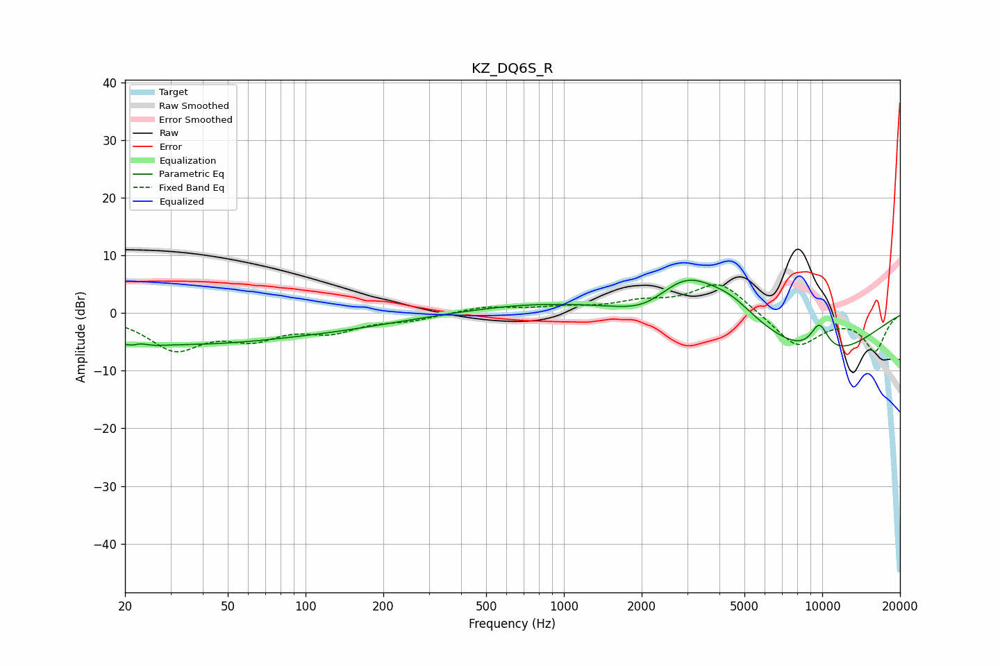

# KZ_DQ6S_R
See [usage instructions](https://github.com/jaakkopasanen/AutoEq#usage) for more options and info.

### Parametric EQs
Apply preamp of -5.8 dB when using parametric equalizer.

|   # | Type    |   Fc (Hz) |    Q |   Gain (dB) |
|-----|---------|-----------|------|-------------|
|   1 | Peaking |        22 | 2.63 |        -4.4 |
|   2 | Peaking |        23 | 3.48 |         3.4 |
|   3 | Peaking |        35 | 0.38 |        -4.8 |
|   4 | Peaking |       137 | 0.5  |        -1.6 |
|   5 | Peaking |       788 | 0.53 |         1.6 |
|   6 | Peaking |      2083 | 1.25 |        -2.7 |
|   7 | Peaking |      2961 | 1.05 |         7.5 |
|   8 | Peaking |      4427 | 1.41 |         2.9 |
|   9 | Peaking |      9609 | 0.51 |        -8   |
|  10 | Peaking |      9749 | 3.41 |         5.1 |

### Fixed Band EQs
When using fixed band (also called graphic) equalizer, apply preamp of **-5.0 dB** (if available) and set gains manually with these parameters.

|   # | Type    |   Fc (Hz) |    Q |   Gain (dB) |
|-----|---------|-----------|------|-------------|
|   1 | Peaking |        31 | 1.41 |        -5.9 |
|   2 | Peaking |        62 | 1.41 |        -3.6 |
|   3 | Peaking |       125 | 1.41 |        -2.8 |
|   4 | Peaking |       250 | 1.41 |        -1.1 |
|   5 | Peaking |       500 | 1.41 |         1.1 |
|   6 | Peaking |      1000 | 1.41 |         0.8 |
|   7 | Peaking |      2000 | 1.41 |         1.6 |
|   8 | Peaking |      4000 | 1.41 |         5.5 |
|   9 | Peaking |      8000 | 1.41 |        -5.9 |
|  10 | Peaking |     16000 | 1.41 |        -6.4 |

### Graphs

