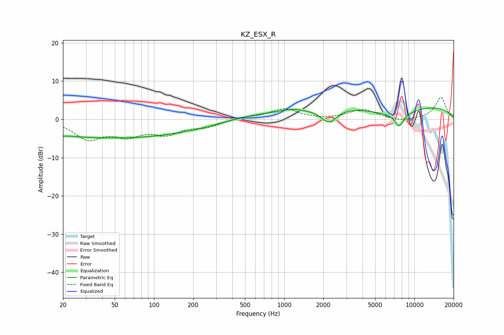

# KZ_ESX_R
See [usage instructions](https://github.com/jaakkopasanen/AutoEq#usage) for more options and info.

### Parametric EQs
Apply preamp of -3.1 dB when using parametric equalizer.

|   # | Type    |   Fc (Hz) |    Q |   Gain (dB) |
|-----|---------|-----------|------|-------------|
|   1 | Peaking |        22 | 0.18 |        -4.5 |
|   2 | Peaking |        22 | 1.97 |         0.3 |
|   3 | Peaking |       202 | 0.33 |        -2.4 |
|   4 | Peaking |       231 | 1.22 |        -0.1 |
|   5 | Peaking |       522 | 0.56 |         1.9 |
|   6 | Peaking |      1104 | 1.82 |         0.7 |
|   7 | Peaking |      2204 | 2.36 |        -3.8 |
|   8 | Peaking |      6860 | 0.64 |        -2.9 |
|   9 | Peaking |      6878 | 0.18 |         4.7 |
|  10 | Peaking |      7663 | 3.83 |        -3.4 |

### Fixed Band EQs
When using fixed band (also called graphic) equalizer, apply preamp of **-5.8 dB** (if available) and set gains manually with these parameters.

|   # | Type    |   Fc (Hz) |    Q |   Gain (dB) |
|-----|---------|-----------|------|-------------|
|   1 | Peaking |        31 | 1.41 |        -4.8 |
|   2 | Peaking |        62 | 1.41 |        -3.6 |
|   3 | Peaking |       125 | 1.41 |        -3.3 |
|   4 | Peaking |       250 | 1.41 |        -1.7 |
|   5 | Peaking |       500 | 1.41 |         0.6 |
|   6 | Peaking |      1000 | 1.41 |         2.7 |
|   7 | Peaking |      2000 | 1.41 |        -0.2 |
|   8 | Peaking |      4000 | 1.41 |         2.6 |
|   9 | Peaking |      8000 | 1.41 |        -0.7 |
|  10 | Peaking |     16000 | 1.41 |         5.7 |

### Graphs

