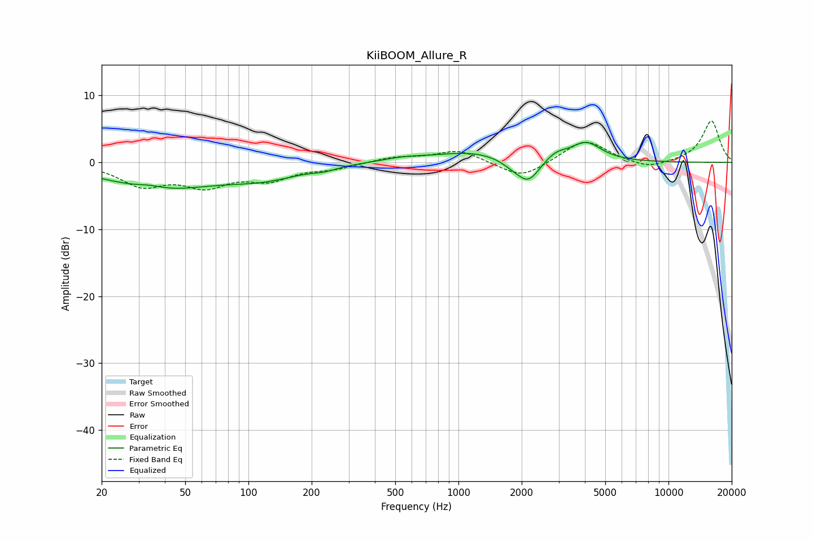

# KiiBOOM_Allure_R
See [usage instructions](https://github.com/jaakkopasanen/AutoEq#usage) for more options and info.

### Parametric EQs
Apply preamp of -3.1 dB when using parametric equalizer.

|   # | Type    |   Fc (Hz) |    Q |   Gain (dB) |
|-----|---------|-----------|------|-------------|
|   1 | Peaking |        34 | 2.13 |         0.6 |
|   2 | Peaking |        38 | 0.56 |        -3.8 |
|   3 | Peaking |       118 | 0.79 |        -1.9 |
|   4 | Peaking |       231 | 2.75 |        -0.4 |
|   5 | Peaking |       547 | 1.31 |         0.6 |
|   6 | Peaking |      1154 | 0.81 |         1.5 |
|   7 | Peaking |      1795 | 2.78 |        -0.7 |
|   8 | Peaking |      2149 | 2.6  |        -3.4 |
|   9 | Peaking |      2908 | 2.83 |         1.1 |
|  10 | Peaking |      4048 | 1.92 |         2.8 |

### Fixed Band EQs
When using fixed band (also called graphic) equalizer, apply preamp of **-6.3 dB** (if available) and set gains manually with these parameters.

|   # | Type    |   Fc (Hz) |    Q |   Gain (dB) |
|-----|---------|-----------|------|-------------|
|   1 | Peaking |        31 | 1.41 |        -3.2 |
|   2 | Peaking |        62 | 1.41 |        -3.1 |
|   3 | Peaking |       125 | 1.41 |        -2.3 |
|   4 | Peaking |       250 | 1.41 |        -0.8 |
|   5 | Peaking |       500 | 1.41 |         0.8 |
|   6 | Peaking |      1000 | 1.41 |         1.9 |
|   7 | Peaking |      2000 | 1.41 |        -2.5 |
|   8 | Peaking |      4000 | 1.41 |         3.5 |
|   9 | Peaking |      8000 | 1.41 |        -1.1 |
|  10 | Peaking |     16000 | 1.41 |         6.2 |

### Graphs

