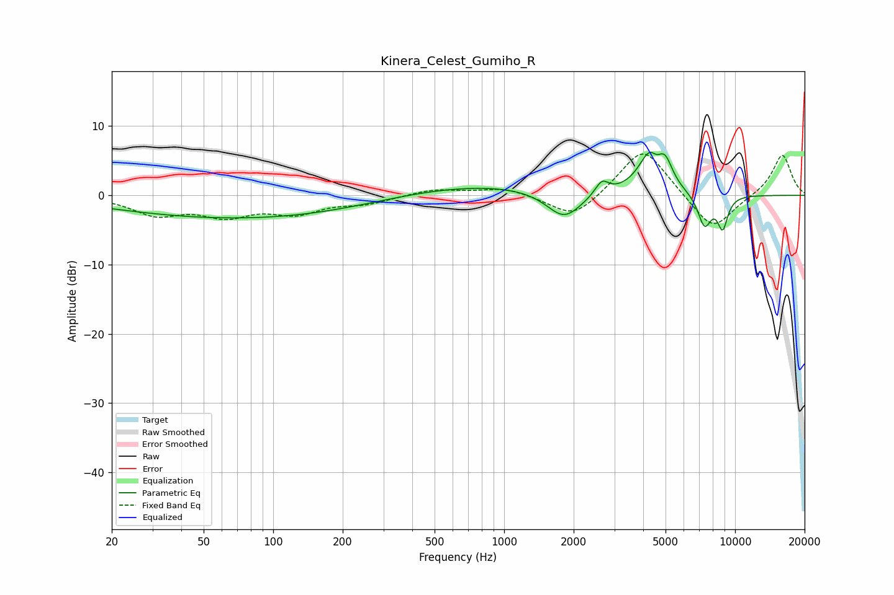

# Kinera_Celest_Gumiho_R
See [usage instructions](https://github.com/jaakkopasanen/AutoEq#usage) for more options and info.

### Parametric EQs
Apply preamp of -6.3 dB when using parametric equalizer.

|   # | Type    |   Fc (Hz) |    Q |   Gain (dB) |
|-----|---------|-----------|------|-------------|
|   1 | Peaking |        70 | 0.23 |        -2.6 |
|   2 | Peaking |       137 | 0.21 |        -0.9 |
|   3 | Peaking |       655 | 0.35 |         2.1 |
|   4 | Peaking |      1819 | 1.83 |        -4.1 |
|   5 | Peaking |      2650 | 4.86 |         2   |
|   6 | Peaking |      4334 | 2.65 |         6.2 |
|   7 | Peaking |      4558 | 5.87 |        -1.3 |
|   8 | Peaking |      4986 | 4.45 |         2.9 |
|   9 | Peaking |      7378 | 4.51 |        -4.6 |
|  10 | Peaking |      8836 | 5.75 |        -4.5 |

### Fixed Band EQs
When using fixed band (also called graphic) equalizer, apply preamp of **-6.1 dB** (if available) and set gains manually with these parameters.

|   # | Type    |   Fc (Hz) |    Q |   Gain (dB) |
|-----|---------|-----------|------|-------------|
|   1 | Peaking |        31 | 1.41 |        -2.6 |
|   2 | Peaking |        62 | 1.41 |        -2.6 |
|   3 | Peaking |       125 | 1.41 |        -2.3 |
|   4 | Peaking |       250 | 1.41 |        -1   |
|   5 | Peaking |       500 | 1.41 |         0.9 |
|   6 | Peaking |      1000 | 1.41 |         1.1 |
|   7 | Peaking |      2000 | 1.41 |        -3.6 |
|   8 | Peaking |      4000 | 1.41 |         7.3 |
|   9 | Peaking |      8000 | 1.41 |        -5.4 |
|  10 | Peaking |     16000 | 1.41 |         6   |

### Graphs

