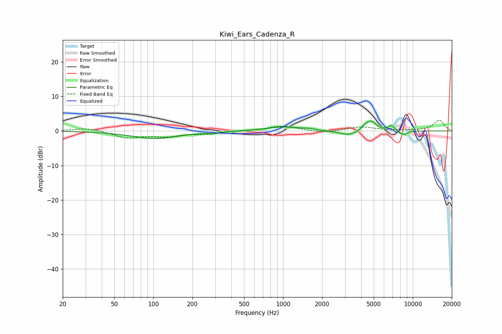

# Kiwi_Ears_Cadenza_R
See [usage instructions](https://github.com/jaakkopasanen/AutoEq#usage) for more options and info.

### Parametric EQs
Apply preamp of -3.0 dB when using parametric equalizer.

|   # | Type    |   Fc (Hz) |    Q |   Gain (dB) |
|-----|---------|-----------|------|-------------|
|   1 | Peaking |       103 | 0.76 |        -2.1 |
|   2 | Peaking |       286 | 4.19 |        -0.4 |
|   3 | Peaking |       983 | 1.22 |         1.2 |
|   4 | Peaking |      1565 | 2.68 |         0.4 |
|   5 | Peaking |      3192 | 2.06 |        -1.4 |
|   6 | Peaking |      4262 | 5.93 |         0.8 |
|   7 | Peaking |      4764 | 3.48 |         2.8 |
|   8 | Peaking |      6846 | 5.98 |         1.5 |
|   9 | Peaking |      7964 | 6    |        -0.5 |
|  10 | Peaking |      8656 | 5.54 |        -1   |

### Fixed Band EQs
When using fixed band (also called graphic) equalizer, apply preamp of **-3.2 dB** (if available) and set gains manually with these parameters.

|   # | Type    |   Fc (Hz) |    Q |   Gain (dB) |
|-----|---------|-----------|------|-------------|
|   1 | Peaking |        31 | 1.41 |         1   |
|   2 | Peaking |        62 | 1.41 |        -1.9 |
|   3 | Peaking |       125 | 1.41 |        -1.4 |
|   4 | Peaking |       250 | 1.41 |        -0.8 |
|   5 | Peaking |       500 | 1.41 |         0.1 |
|   6 | Peaking |      1000 | 1.41 |         1.5 |
|   7 | Peaking |      2000 | 1.41 |        -0.6 |
|   8 | Peaking |      4000 | 1.41 |         1.2 |
|   9 | Peaking |      8000 | 1.41 |         0   |
|  10 | Peaking |     16000 | 1.41 |         3.1 |

### Graphs

