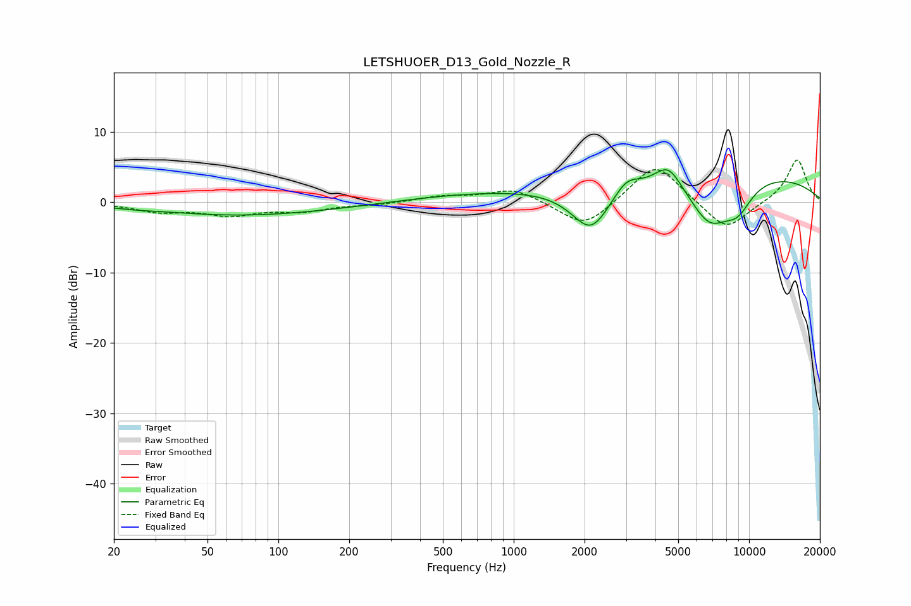

# LETSHUOER_D13_Gold_Nozzle_R
See [usage instructions](https://github.com/jaakkopasanen/AutoEq#usage) for more options and info.

### Parametric EQs
Apply preamp of -4.7 dB when using parametric equalizer.

|   # | Type    |   Fc (Hz) |    Q |   Gain (dB) |
|-----|---------|-----------|------|-------------|
|   1 | Peaking |        25 | 1.72 |        -0.2 |
|   2 | Peaking |       108 | 0.29 |        -2.5 |
|   3 | Peaking |       441 | 0.23 |         1.8 |
|   4 | Peaking |      2132 | 1.67 |        -6.5 |
|   5 | Peaking |      2548 | 2.49 |         0   |
|   6 | Peaking |      3013 | 2.66 |         2   |
|   7 | Peaking |      4533 | 2.47 |         3.3 |
|   8 | Peaking |      6784 | 1.47 |        -6.5 |
|   9 | Peaking |      8079 | 0.24 |         4.5 |
|  10 | Peaking |      8941 | 2    |        -3.5 |

### Fixed Band EQs
When using fixed band (also called graphic) equalizer, apply preamp of **-6.1 dB** (if available) and set gains manually with these parameters.

|   # | Type    |   Fc (Hz) |    Q |   Gain (dB) |
|-----|---------|-----------|------|-------------|
|   1 | Peaking |        31 | 1.41 |        -1.2 |
|   2 | Peaking |        62 | 1.41 |        -1.6 |
|   3 | Peaking |       125 | 1.41 |        -1.1 |
|   4 | Peaking |       250 | 1.41 |        -0.3 |
|   5 | Peaking |       500 | 1.41 |         0.8 |
|   6 | Peaking |      1000 | 1.41 |         1.9 |
|   7 | Peaking |      2000 | 1.41 |        -3.8 |
|   8 | Peaking |      4000 | 1.41 |         5.8 |
|   9 | Peaking |      8000 | 1.41 |        -4.2 |
|  10 | Peaking |     16000 | 1.41 |         6.2 |

### Graphs

