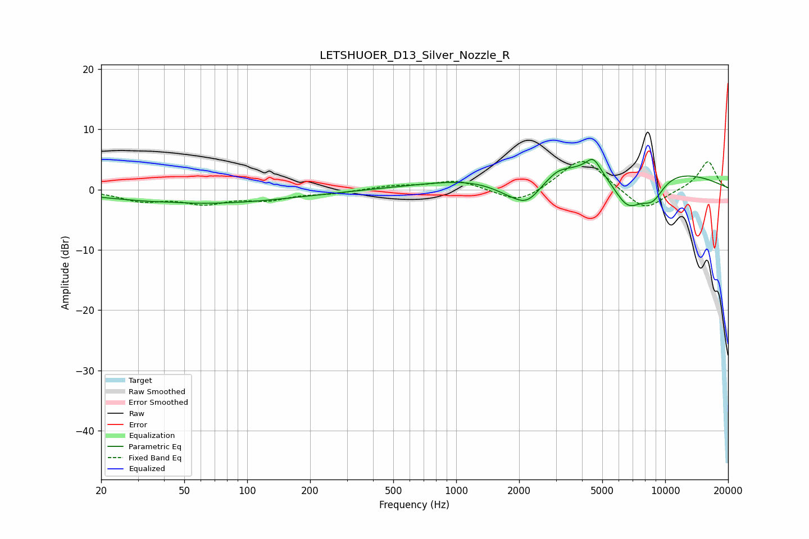

# LETSHUOER_D13_Silver_Nozzle_R
See [usage instructions](https://github.com/jaakkopasanen/AutoEq#usage) for more options and info.

### Parametric EQs
Apply preamp of -5.1 dB when using parametric equalizer.

|   # | Type    |   Fc (Hz) |    Q |   Gain (dB) |
|-----|---------|-----------|------|-------------|
|   1 | Peaking |        44 | 2.91 |         0.1 |
|   2 | Peaking |        61 | 0.33 |        -2.3 |
|   3 | Peaking |      1941 | 1.09 |        -4.2 |
|   4 | Peaking |      2211 | 2.2  |        -2.6 |
|   5 | Peaking |      3062 | 3.37 |         0.6 |
|   6 | Peaking |      3411 | 0.29 |         4   |
|   7 | Peaking |      4531 | 4.12 |         2.4 |
|   8 | Peaking |      6612 | 1.64 |        -6.8 |
|   9 | Peaking |      7354 | 0.23 |         2.3 |
|  10 | Peaking |      8717 | 2.24 |        -3.7 |

### Fixed Band EQs
When using fixed band (also called graphic) equalizer, apply preamp of **-4.7 dB** (if available) and set gains manually with these parameters.

|   # | Type    |   Fc (Hz) |    Q |   Gain (dB) |
|-----|---------|-----------|------|-------------|
|   1 | Peaking |        31 | 1.41 |        -1.7 |
|   2 | Peaking |        62 | 1.41 |        -2   |
|   3 | Peaking |       125 | 1.41 |        -1.5 |
|   4 | Peaking |       250 | 1.41 |        -0.5 |
|   5 | Peaking |       500 | 1.41 |         0.6 |
|   6 | Peaking |      1000 | 1.41 |         1.5 |
|   7 | Peaking |      2000 | 1.41 |        -2.5 |
|   8 | Peaking |      4000 | 1.41 |         5.5 |
|   9 | Peaking |      8000 | 1.41 |        -3.7 |
|  10 | Peaking |     16000 | 1.41 |         4.8 |

### Graphs

