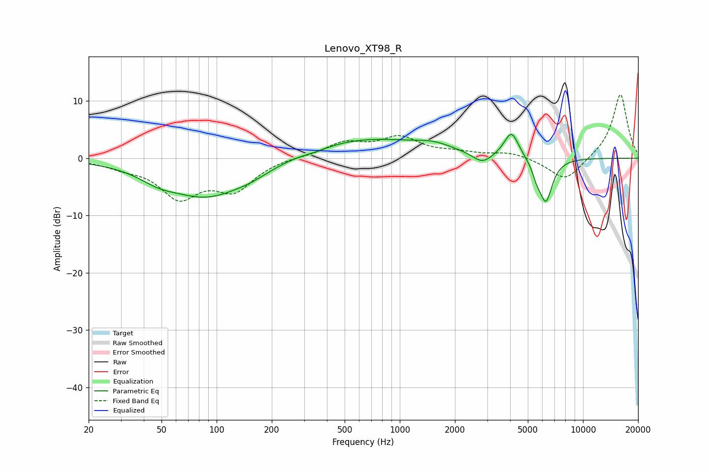

# Lenovo_XT98_R
See [usage instructions](https://github.com/jaakkopasanen/AutoEq#usage) for more options and info.

### Parametric EQs
Apply preamp of -4.2 dB when using parametric equalizer.

|   # | Type    |   Fc (Hz) |    Q |   Gain (dB) |
|-----|---------|-----------|------|-------------|
|   1 | Peaking |        48 | 1.47 |        -1.4 |
|   2 | Peaking |        88 | 0.63 |        -6.6 |
|   3 | Peaking |       158 | 1.21 |        -1.1 |
|   4 | Peaking |       346 | 1.7  |        -0.5 |
|   5 | Peaking |       621 | 0.39 |         3.6 |
|   6 | Peaking |      1536 | 1.5  |         1   |
|   7 | Peaking |      2821 | 2.64 |        -1.9 |
|   8 | Peaking |      4068 | 3.49 |         4.6 |
|   9 | Peaking |      5585 | 5.99 |        -1.8 |
|  10 | Peaking |      6271 | 3.82 |        -7.5 |

### Fixed Band EQs
When using fixed band (also called graphic) equalizer, apply preamp of **-11.2 dB** (if available) and set gains manually with these parameters.

|   # | Type    |   Fc (Hz) |    Q |   Gain (dB) |
|-----|---------|-----------|------|-------------|
|   1 | Peaking |        31 | 1.41 |        -1.1 |
|   2 | Peaking |        62 | 1.41 |        -6.4 |
|   3 | Peaking |       125 | 1.41 |        -5.1 |
|   4 | Peaking |       250 | 1.41 |         0.2 |
|   5 | Peaking |       500 | 1.41 |         2.5 |
|   6 | Peaking |      1000 | 1.41 |         3.4 |
|   7 | Peaking |      2000 | 1.41 |         0.8 |
|   8 | Peaking |      4000 | 1.41 |         1   |
|   9 | Peaking |      8000 | 1.41 |        -4.1 |
|  10 | Peaking |     16000 | 1.41 |        11.3 |

### Graphs

