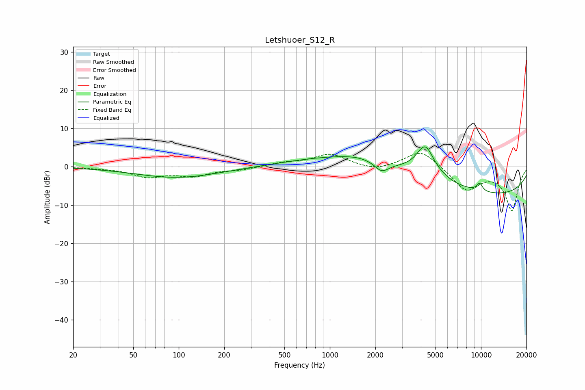

# Letshuoer_S12_R
See [usage instructions](https://github.com/jaakkopasanen/AutoEq#usage) for more options and info.

### Parametric EQs
Apply preamp of -5.3 dB when using parametric equalizer.

|   # | Type    |   Fc (Hz) |    Q |   Gain (dB) |
|-----|---------|-----------|------|-------------|
|   1 | Peaking |        98 | 0.51 |        -2.9 |
|   2 | Peaking |      1634 | 1.03 |         1   |
|   3 | Peaking |      1719 | 4.04 |        -0   |
|   4 | Peaking |      2036 | 0.31 |         5   |
|   5 | Peaking |      2197 | 2.96 |        -2.7 |
|   6 | Peaking |      4279 | 2.27 |         8.3 |
|   7 | Peaking |      5734 | 5.08 |         0.1 |
|   8 | Peaking |      9045 | 0.18 |        -8   |
|   9 | Peaking |      9868 | 5.7  |         3.4 |
|  10 | Peaking |     10000 | 5.48 |        -1.3 |

### Fixed Band EQs
When using fixed band (also called graphic) equalizer, apply preamp of **-3.6 dB** (if available) and set gains manually with these parameters.

|   # | Type    |   Fc (Hz) |    Q |   Gain (dB) |
|-----|---------|-----------|------|-------------|
|   1 | Peaking |        31 | 1.41 |        -0.2 |
|   2 | Peaking |        62 | 1.41 |        -2.5 |
|   3 | Peaking |       125 | 1.41 |        -2.2 |
|   4 | Peaking |       250 | 1.41 |        -0.7 |
|   5 | Peaking |       500 | 1.41 |         0.9 |
|   6 | Peaking |      1000 | 1.41 |         3.2 |
|   7 | Peaking |      2000 | 1.41 |        -1.2 |
|   8 | Peaking |      4000 | 1.41 |         4.6 |
|   9 | Peaking |      8000 | 1.41 |        -6   |
|  10 | Peaking |     16000 | 1.41 |       -11.3 |

### Graphs

