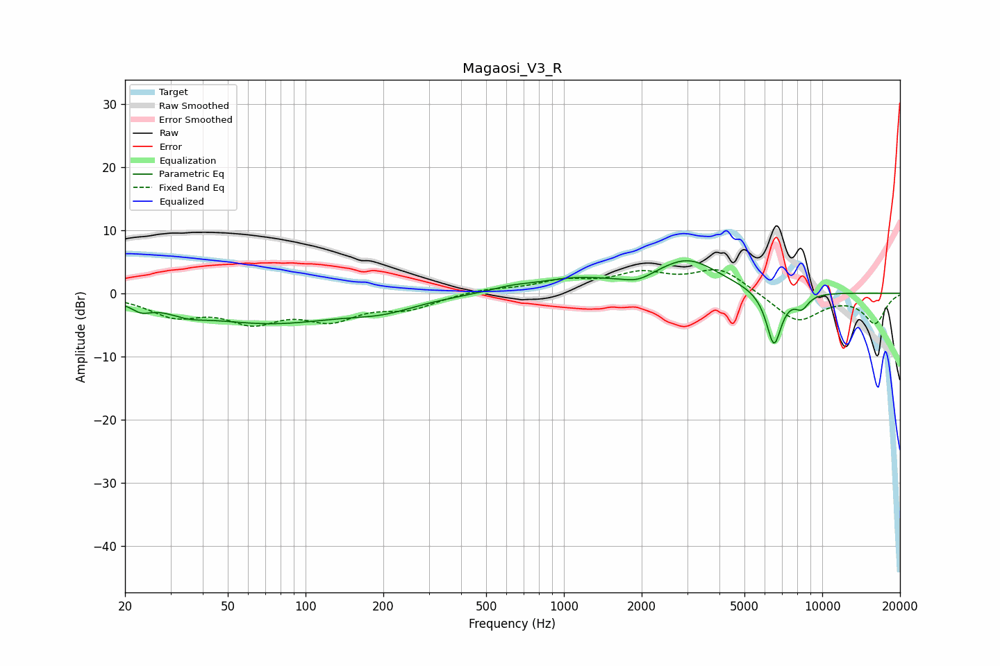

# Magaosi_V3_R
See [usage instructions](https://github.com/jaakkopasanen/AutoEq#usage) for more options and info.

### Parametric EQs
Apply preamp of -5.2 dB when using parametric equalizer.

|   # | Type    |   Fc (Hz) |    Q |   Gain (dB) |
|-----|---------|-----------|------|-------------|
|   1 | Peaking |        23 | 4.05 |        -1.2 |
|   2 | Peaking |        35 | 2.03 |        -1   |
|   3 | Peaking |        72 | 0.47 |        -4.6 |
|   4 | Peaking |       201 | 1.1  |        -1.5 |
|   5 | Peaking |       625 | 1.71 |         0.6 |
|   6 | Peaking |      1094 | 0.93 |         1.9 |
|   7 | Peaking |      1935 | 2.68 |        -1   |
|   8 | Peaking |      3014 | 1.13 |         5.1 |
|   9 | Peaking |      6501 | 4.46 |        -8.7 |
|  10 | Peaking |      8335 | 4.85 |        -2   |

### Fixed Band EQs
When using fixed band (also called graphic) equalizer, apply preamp of **-3.8 dB** (if available) and set gains manually with these parameters.

|   # | Type    |   Fc (Hz) |    Q |   Gain (dB) |
|-----|---------|-----------|------|-------------|
|   1 | Peaking |        31 | 1.41 |        -3.2 |
|   2 | Peaking |        62 | 1.41 |        -3.9 |
|   3 | Peaking |       125 | 1.41 |        -3.6 |
|   4 | Peaking |       250 | 1.41 |        -2.1 |
|   5 | Peaking |       500 | 1.41 |         0.7 |
|   6 | Peaking |      1000 | 1.41 |         1.7 |
|   7 | Peaking |      2000 | 1.41 |         2.7 |
|   8 | Peaking |      4000 | 1.41 |         3.8 |
|   9 | Peaking |      8000 | 1.41 |        -4.6 |
|  10 | Peaking |     16000 | 1.41 |        -4.6 |

### Graphs

