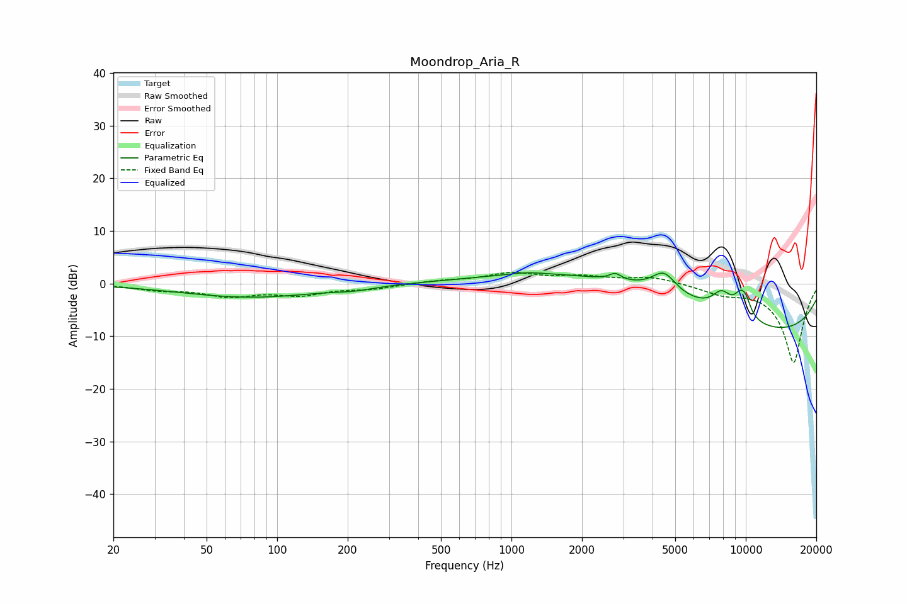

# Moondrop_Aria_R
See [usage instructions](https://github.com/jaakkopasanen/AutoEq#usage) for more options and info.

### Parametric EQs
Apply preamp of -2.1 dB when using parametric equalizer.

|   # | Type    |   Fc (Hz) |    Q |   Gain (dB) |
|-----|---------|-----------|------|-------------|
|   1 | Peaking |        77 | 0.47 |        -2.6 |
|   2 | Peaking |       213 | 1.77 |        -0.5 |
|   3 | Peaking |      1163 | 1.61 |         0.6 |
|   4 | Peaking |      2774 | 5.73 |         1.2 |
|   5 | Peaking |      3316 | 0.3  |         9.5 |
|   6 | Peaking |      4477 | 2.72 |         3.9 |
|   7 | Peaking |      7899 | 3.16 |         3.6 |
|   8 | Peaking |      8204 | 0.18 |       -12.5 |
|   9 | Peaking |      9488 | 4.17 |         3.4 |
|  10 | Peaking |     10000 | 5.42 |         2.2 |

### Fixed Band EQs
When using fixed band (also called graphic) equalizer, apply preamp of **-2.2 dB** (if available) and set gains manually with these parameters.

|   # | Type    |   Fc (Hz) |    Q |   Gain (dB) |
|-----|---------|-----------|------|-------------|
|   1 | Peaking |        31 | 1.41 |        -1   |
|   2 | Peaking |        62 | 1.41 |        -2.1 |
|   3 | Peaking |       125 | 1.41 |        -1.9 |
|   4 | Peaking |       250 | 1.41 |        -0.9 |
|   5 | Peaking |       500 | 1.41 |         0.5 |
|   6 | Peaking |      1000 | 1.41 |         1.8 |
|   7 | Peaking |      2000 | 1.41 |         1.2 |
|   8 | Peaking |      4000 | 1.41 |         1.3 |
|   9 | Peaking |      8000 | 1.41 |        -1.6 |
|  10 | Peaking |     16000 | 1.41 |       -15.1 |

### Graphs

