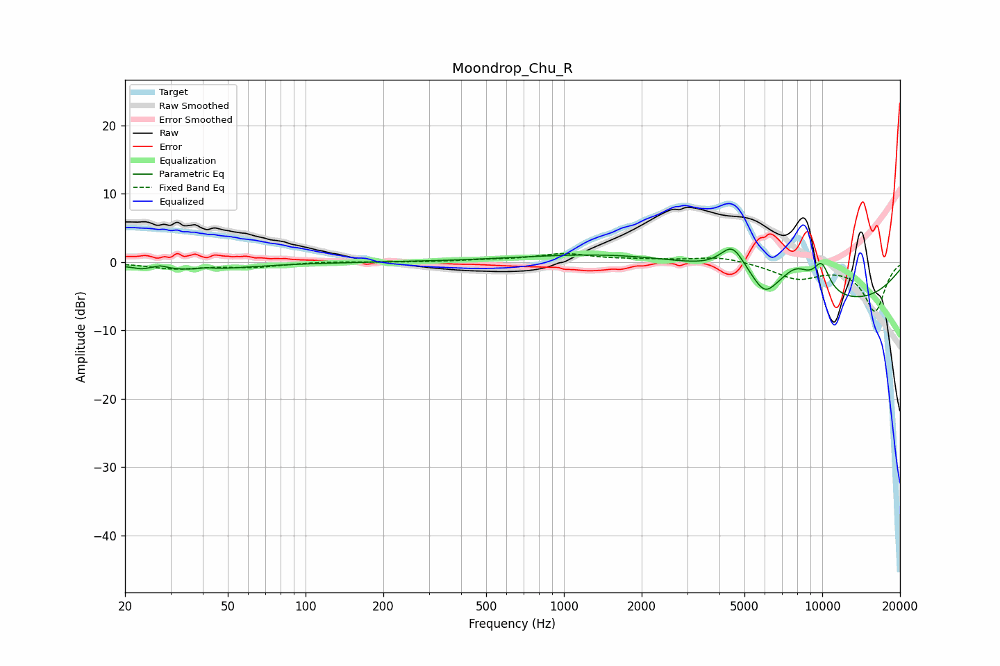

# Moondrop_Chu_R
See [usage instructions](https://github.com/jaakkopasanen/AutoEq#usage) for more options and info.

### Parametric EQs
Apply preamp of -2.0 dB when using parametric equalizer.

|   # | Type    |   Fc (Hz) |    Q |   Gain (dB) |
|-----|---------|-----------|------|-------------|
|   1 | Peaking |        23 | 5.95 |        -0.3 |
|   2 | Peaking |        27 | 5.9  |         0.4 |
|   3 | Peaking |        36 | 0.67 |        -1.1 |
|   4 | Peaking |        41 | 5.99 |         0.2 |
|   5 | Peaking |      3430 | 0.31 |         6.8 |
|   6 | Peaking |      4492 | 2.87 |         3.9 |
|   7 | Peaking |      5990 | 3.02 |        -2.8 |
|   8 | Peaking |      7190 | 0.22 |        -9   |
|   9 | Peaking |      7951 | 2.2  |         3   |
|  10 | Peaking |      9953 | 3.82 |         3.9 |

### Fixed Band EQs
When using fixed band (also called graphic) equalizer, apply preamp of **-1.3 dB** (if available) and set gains manually with these parameters.

|   # | Type    |   Fc (Hz) |    Q |   Gain (dB) |
|-----|---------|-----------|------|-------------|
|   1 | Peaking |        31 | 1.41 |        -0.9 |
|   2 | Peaking |        62 | 1.41 |        -0.7 |
|   3 | Peaking |       125 | 1.41 |         0.1 |
|   4 | Peaking |       250 | 1.41 |        -0   |
|   5 | Peaking |       500 | 1.41 |         0.2 |
|   6 | Peaking |      1000 | 1.41 |         1.1 |
|   7 | Peaking |      2000 | 1.41 |         0.3 |
|   8 | Peaking |      4000 | 1.41 |         0.9 |
|   9 | Peaking |      8000 | 1.41 |        -2.3 |
|  10 | Peaking |     16000 | 1.41 |        -7.1 |

### Graphs

