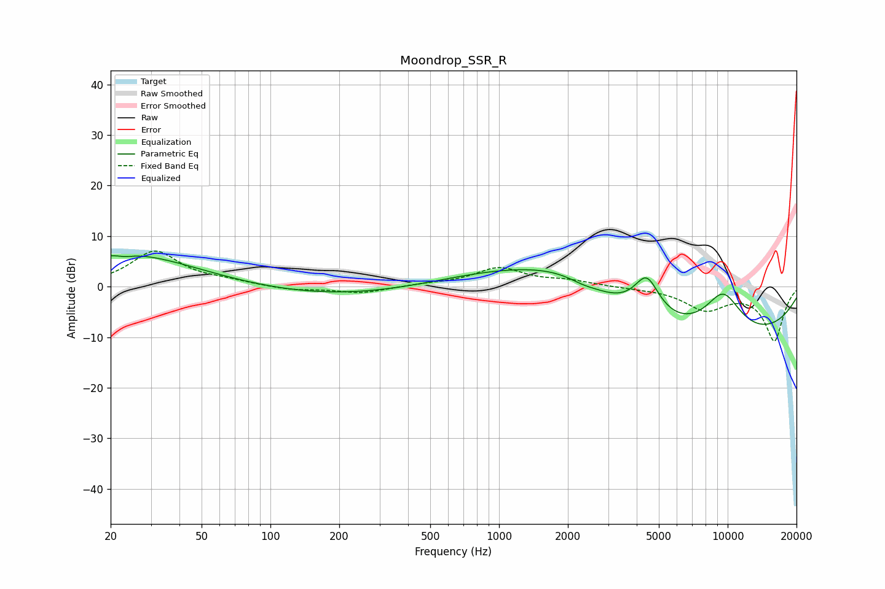

# Moondrop_SSR_R
See [usage instructions](https://github.com/jaakkopasanen/AutoEq#usage) for more options and info.

### Parametric EQs
Apply preamp of -6.2 dB when using parametric equalizer.

|   # | Type    |   Fc (Hz) |    Q |   Gain (dB) |
|-----|---------|-----------|------|-------------|
|   1 | Peaking |        22 | 0.3  |         5.6 |
|   2 | Peaking |        23 | 4.73 |        -0.4 |
|   3 | Peaking |        27 | 0.77 |         1.4 |
|   4 | Peaking |       146 | 0.27 |        -2.4 |
|   5 | Peaking |      1420 | 0.39 |         5.9 |
|   6 | Peaking |      1981 | 0.72 |         3.4 |
|   7 | Peaking |      2310 | 2.55 |        -0.6 |
|   8 | Peaking |      4425 | 2.41 |         8   |
|   9 | Peaking |      7666 | 0.21 |       -12.2 |
|  10 | Peaking |      9533 | 1.38 |         9.4 |

### Fixed Band EQs
When using fixed band (also called graphic) equalizer, apply preamp of **-7.1 dB** (if available) and set gains manually with these parameters.

|   # | Type    |   Fc (Hz) |    Q |   Gain (dB) |
|-----|---------|-----------|------|-------------|
|   1 | Peaking |        31 | 1.41 |         6.9 |
|   2 | Peaking |        62 | 1.41 |         0.8 |
|   3 | Peaking |       125 | 1.41 |        -0.7 |
|   4 | Peaking |       250 | 1.41 |        -1.3 |
|   5 | Peaking |       500 | 1.41 |         0.4 |
|   6 | Peaking |      1000 | 1.41 |         3.6 |
|   7 | Peaking |      2000 | 1.41 |         1   |
|   8 | Peaking |      4000 | 1.41 |        -0.2 |
|   9 | Peaking |      8000 | 1.41 |        -4.3 |
|  10 | Peaking |     16000 | 1.41 |       -10.6 |

### Graphs

