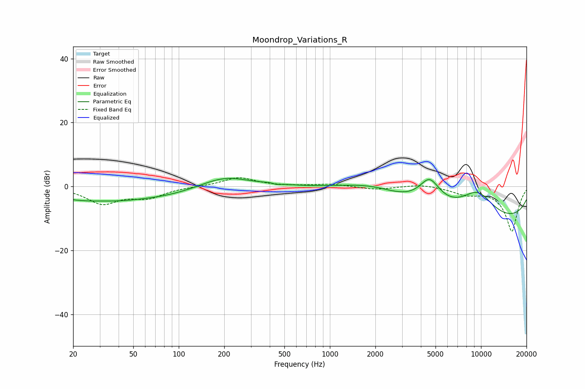

# Moondrop_Variations_R
See [usage instructions](https://github.com/jaakkopasanen/AutoEq#usage) for more options and info.

### Parametric EQs
Apply preamp of -2.6 dB when using parametric equalizer.

|   # | Type    |   Fc (Hz) |    Q |   Gain (dB) |
|-----|---------|-----------|------|-------------|
|   1 | Peaking |        21 | 0.66 |        -3.3 |
|   2 | Peaking |        42 | 0.88 |        -1.4 |
|   3 | Peaking |        80 | 0.57 |        -2.6 |
|   4 | Peaking |       200 | 0.86 |         3.7 |
|   5 | Peaking |       430 | 3.28 |         0.9 |
|   6 | Peaking |       440 | 4.73 |        -1   |
|   7 | Peaking |      1932 | 0.66 |         4.3 |
|   8 | Peaking |      4566 | 1.91 |         8.5 |
|   9 | Peaking |      9438 | 1.03 |         8.9 |
|  10 | Peaking |     10000 | 0.18 |       -11.8 |

### Fixed Band EQs
When using fixed band (also called graphic) equalizer, apply preamp of **-2.8 dB** (if available) and set gains manually with these parameters.

|   # | Type    |   Fc (Hz) |    Q |   Gain (dB) |
|-----|---------|-----------|------|-------------|
|   1 | Peaking |        31 | 1.41 |        -5.1 |
|   2 | Peaking |        62 | 1.41 |        -3.1 |
|   3 | Peaking |       125 | 1.41 |         0   |
|   4 | Peaking |       250 | 1.41 |         2.8 |
|   5 | Peaking |       500 | 1.41 |         0   |
|   6 | Peaking |      1000 | 1.41 |         0.8 |
|   7 | Peaking |      2000 | 1.41 |        -1   |
|   8 | Peaking |      4000 | 1.41 |         0.8 |
|   9 | Peaking |      8000 | 1.41 |        -2.1 |
|  10 | Peaking |     16000 | 1.41 |       -14   |

### Graphs

