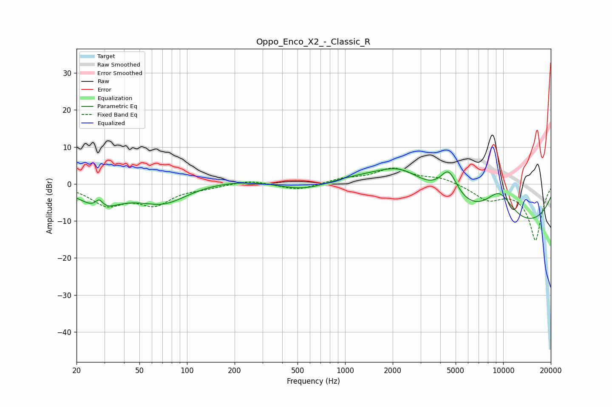

# Oppo_Enco_X2_-_Classic_R
See [usage instructions](https://github.com/jaakkopasanen/AutoEq#usage) for more options and info.

### Parametric EQs
Apply preamp of -4.2 dB when using parametric equalizer.

|   # | Type    |   Fc (Hz) |    Q |   Gain (dB) |
|-----|---------|-----------|------|-------------|
|   1 | Peaking |        28 | 6    |         2.4 |
|   2 | Peaking |        28 | 1.17 |        -5.7 |
|   3 | Peaking |        71 | 0.86 |        -5.7 |
|   4 | Peaking |       261 | 0.24 |         1.9 |
|   5 | Peaking |       561 | 0.7  |        -5.2 |
|   6 | Peaking |      1942 | 0.26 |         6.6 |
|   7 | Peaking |      2262 | 0.91 |         5.6 |
|   8 | Peaking |      4521 | 2.39 |         8.1 |
|   9 | Peaking |      8435 | 0.23 |       -17.2 |
|  10 | Peaking |      9420 | 1.07 |        11.4 |

### Fixed Band EQs
When using fixed band (also called graphic) equalizer, apply preamp of **-4.4 dB** (if available) and set gains manually with these parameters.

|   # | Type    |   Fc (Hz) |    Q |   Gain (dB) |
|-----|---------|-----------|------|-------------|
|   1 | Peaking |        31 | 1.41 |        -5.3 |
|   2 | Peaking |        62 | 1.41 |        -5   |
|   3 | Peaking |       125 | 1.41 |        -0.8 |
|   4 | Peaking |       250 | 1.41 |         1.1 |
|   5 | Peaking |       500 | 1.41 |        -1.7 |
|   6 | Peaking |      1000 | 1.41 |         1.3 |
|   7 | Peaking |      2000 | 1.41 |         4   |
|   8 | Peaking |      4000 | 1.41 |         1.6 |
|   9 | Peaking |      8000 | 1.41 |        -3.8 |
|  10 | Peaking |     16000 | 1.41 |       -15.2 |

### Graphs

