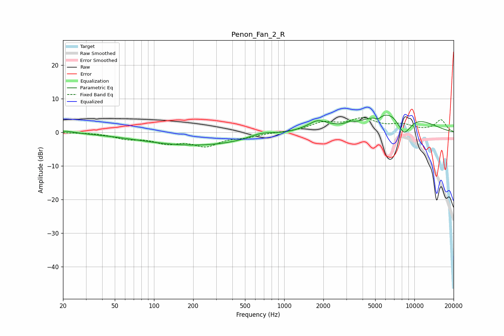

# Penon_Fan_2_R
See [usage instructions](https://github.com/jaakkopasanen/AutoEq#usage) for more options and info.

### Parametric EQs
Apply preamp of -5.2 dB when using parametric equalizer.

|   # | Type    |   Fc (Hz) |    Q |   Gain (dB) |
|-----|---------|-----------|------|-------------|
|   1 | Peaking |        21 | 2.21 |         0.6 |
|   2 | Peaking |       213 | 0.32 |        -3.9 |
|   3 | Peaking |       668 | 1.46 |         1.5 |
|   4 | Peaking |      1622 | 2.66 |        -0.7 |
|   5 | Peaking |      1750 | 1.83 |         3.5 |
|   6 | Peaking |      3240 | 5.14 |         1.2 |
|   7 | Peaking |      3266 | 3.84 |        -0.7 |
|   8 | Peaking |      5258 | 6    |        -1   |
|   9 | Peaking |      7595 | 0.73 |         9.9 |
|  10 | Peaking |      8295 | 1.9  |        -9.4 |

### Fixed Band EQs
When using fixed band (also called graphic) equalizer, apply preamp of **-4.4 dB** (if available) and set gains manually with these parameters.

|   # | Type    |   Fc (Hz) |    Q |   Gain (dB) |
|-----|---------|-----------|------|-------------|
|   1 | Peaking |        31 | 1.41 |         0   |
|   2 | Peaking |        62 | 1.41 |        -1.6 |
|   3 | Peaking |       125 | 1.41 |        -2.7 |
|   4 | Peaking |       250 | 1.41 |        -3.7 |
|   5 | Peaking |       500 | 1.41 |        -1.1 |
|   6 | Peaking |      1000 | 1.41 |         0   |
|   7 | Peaking |      2000 | 1.41 |         2.6 |
|   8 | Peaking |      4000 | 1.41 |         3.6 |
|   9 | Peaking |      8000 | 1.41 |         1.9 |
|  10 | Peaking |     16000 | 1.41 |         3.6 |

### Graphs

