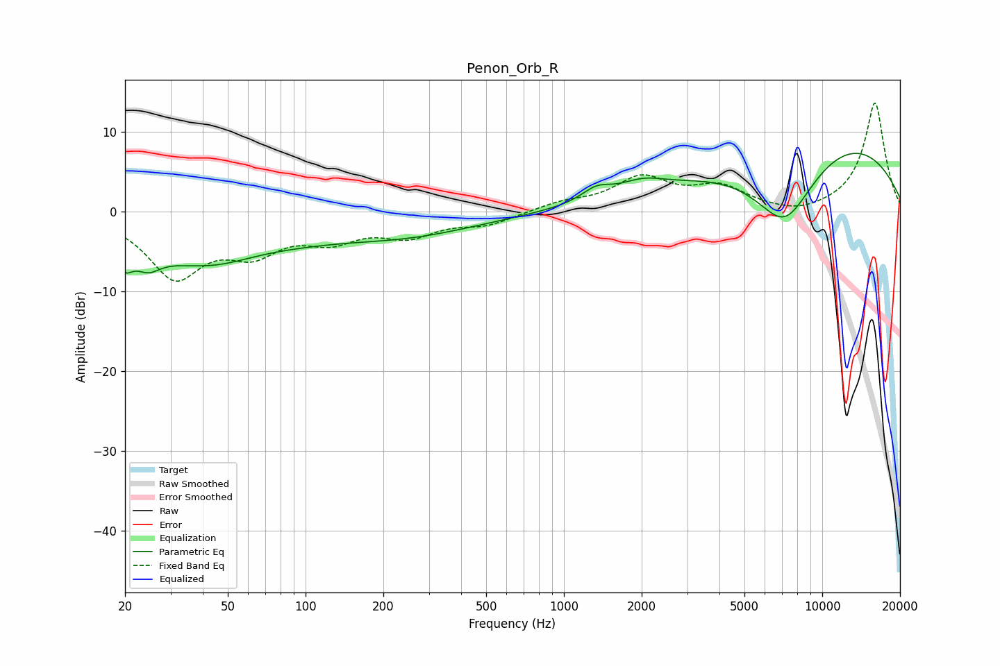

# Penon_Orb_R
See [usage instructions](https://github.com/jaakkopasanen/AutoEq#usage) for more options and info.

### Parametric EQs
Apply preamp of -7.4 dB when using parametric equalizer.

|   # | Type    |   Fc (Hz) |    Q |   Gain (dB) |
|-----|---------|-----------|------|-------------|
|   1 | Peaking |        20 | 5.27 |        -6   |
|   2 | Peaking |        20 | 6    |         3.2 |
|   3 | Peaking |        25 | 2.97 |        -2.1 |
|   4 | Peaking |        44 | 0.48 |        -6.9 |
|   5 | Peaking |        65 | 0.92 |         1.1 |
|   6 | Peaking |       248 | 0.5  |        -2.5 |
|   7 | Peaking |      1337 | 2.45 |         1.6 |
|   8 | Peaking |      2007 | 1.63 |         1.5 |
|   9 | Peaking |      7153 | 0.97 |       -11.2 |
|  10 | Peaking |      9440 | 0.29 |        11.1 |

### Fixed Band EQs
When using fixed band (also called graphic) equalizer, apply preamp of **-13.7 dB** (if available) and set gains manually with these parameters.

|   # | Type    |   Fc (Hz) |    Q |   Gain (dB) |
|-----|---------|-----------|------|-------------|
|   1 | Peaking |        31 | 1.41 |        -7.8 |
|   2 | Peaking |        62 | 1.41 |        -4.1 |
|   3 | Peaking |       125 | 1.41 |        -2.9 |
|   4 | Peaking |       250 | 1.41 |        -2.6 |
|   5 | Peaking |       500 | 1.41 |        -1.4 |
|   6 | Peaking |      1000 | 1.41 |         1   |
|   7 | Peaking |      2000 | 1.41 |         4   |
|   8 | Peaking |      4000 | 1.41 |         2.8 |
|   9 | Peaking |      8000 | 1.41 |        -0.7 |
|  10 | Peaking |     16000 | 1.41 |        13.8 |

### Graphs

