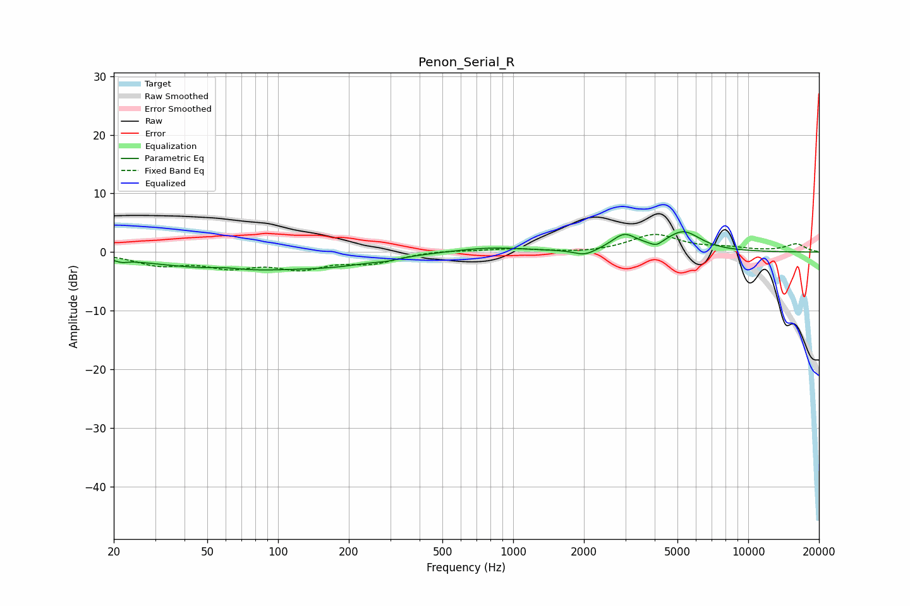

# Penon_Serial_R
See [usage instructions](https://github.com/jaakkopasanen/AutoEq#usage) for more options and info.

### Parametric EQs
Apply preamp of -3.6 dB when using parametric equalizer.

|   # | Type    |   Fc (Hz) |    Q |   Gain (dB) |
|-----|---------|-----------|------|-------------|
|   1 | Peaking |        22 | 5.87 |        -0.4 |
|   2 | Peaking |        59 | 2.44 |         0.4 |
|   3 | Peaking |        71 | 0.37 |        -3   |
|   4 | Peaking |       184 | 1.03 |        -0.7 |
|   5 | Peaking |       291 | 2.74 |        -0.4 |
|   6 | Peaking |       798 | 0.91 |         0.9 |
|   7 | Peaking |      2021 | 3.1  |        -1   |
|   8 | Peaking |      2968 | 2.68 |         2.7 |
|   9 | Peaking |      4068 | 5.31 |        -0.8 |
|  10 | Peaking |      5293 | 1.89 |         3.3 |

### Fixed Band EQs
When using fixed band (also called graphic) equalizer, apply preamp of **-3.1 dB** (if available) and set gains manually with these parameters.

|   # | Type    |   Fc (Hz) |    Q |   Gain (dB) |
|-----|---------|-----------|------|-------------|
|   1 | Peaking |        31 | 1.41 |        -2   |
|   2 | Peaking |        62 | 1.41 |        -2.2 |
|   3 | Peaking |       125 | 1.41 |        -2.4 |
|   4 | Peaking |       250 | 1.41 |        -1.7 |
|   5 | Peaking |       500 | 1.41 |         0.3 |
|   6 | Peaking |      1000 | 1.41 |         0.5 |
|   7 | Peaking |      2000 | 1.41 |        -0.2 |
|   8 | Peaking |      4000 | 1.41 |         2.9 |
|   9 | Peaking |      8000 | 1.41 |         0.6 |
|  10 | Peaking |     16000 | 1.41 |         1.4 |

### Graphs

