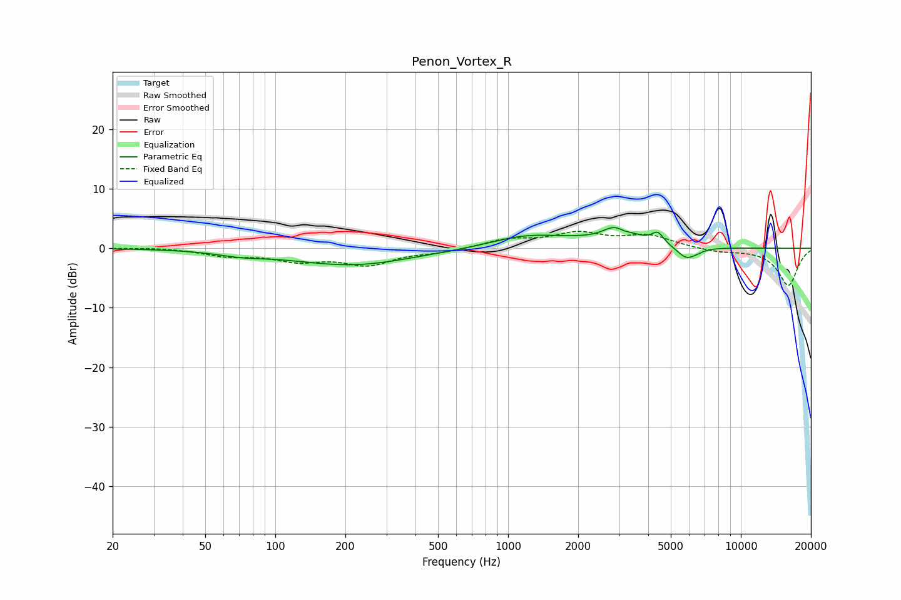

# Penon_Vortex_R
See [usage instructions](https://github.com/jaakkopasanen/AutoEq#usage) for more options and info.

### Parametric EQs
Apply preamp of -3.6 dB when using parametric equalizer.

|   # | Type    |   Fc (Hz) |    Q |   Gain (dB) |
|-----|---------|-----------|------|-------------|
|   1 | Peaking |        72 | 1.3  |        -0.7 |
|   2 | Peaking |       214 | 0.55 |        -2.8 |
|   3 | Peaking |      1159 | 0.97 |         1.6 |
|   4 | Peaking |      1640 | 0.87 |         0.7 |
|   5 | Peaking |      2522 | 2.19 |        -1.1 |
|   6 | Peaking |      2862 | 1.72 |         4   |
|   7 | Peaking |      3160 | 5.29 |        -0.6 |
|   8 | Peaking |      4398 | 5.32 |         1.9 |
|   9 | Peaking |      5848 | 3.3  |        -2.1 |
|  10 | Peaking |      6538 | 6    |        -0.2 |

### Fixed Band EQs
When using fixed band (also called graphic) equalizer, apply preamp of **-2.9 dB** (if available) and set gains manually with these parameters.

|   # | Type    |   Fc (Hz) |    Q |   Gain (dB) |
|-----|---------|-----------|------|-------------|
|   1 | Peaking |        31 | 1.41 |         0.2 |
|   2 | Peaking |        62 | 1.41 |        -1.1 |
|   3 | Peaking |       125 | 1.41 |        -1.8 |
|   4 | Peaking |       250 | 1.41 |        -2.6 |
|   5 | Peaking |       500 | 1.41 |        -0.6 |
|   6 | Peaking |      1000 | 1.41 |         1.4 |
|   7 | Peaking |      2000 | 1.41 |         2.3 |
|   8 | Peaking |      4000 | 1.41 |         2   |
|   9 | Peaking |      8000 | 1.41 |        -0.6 |
|  10 | Peaking |     16000 | 1.41 |        -6.3 |

### Graphs

