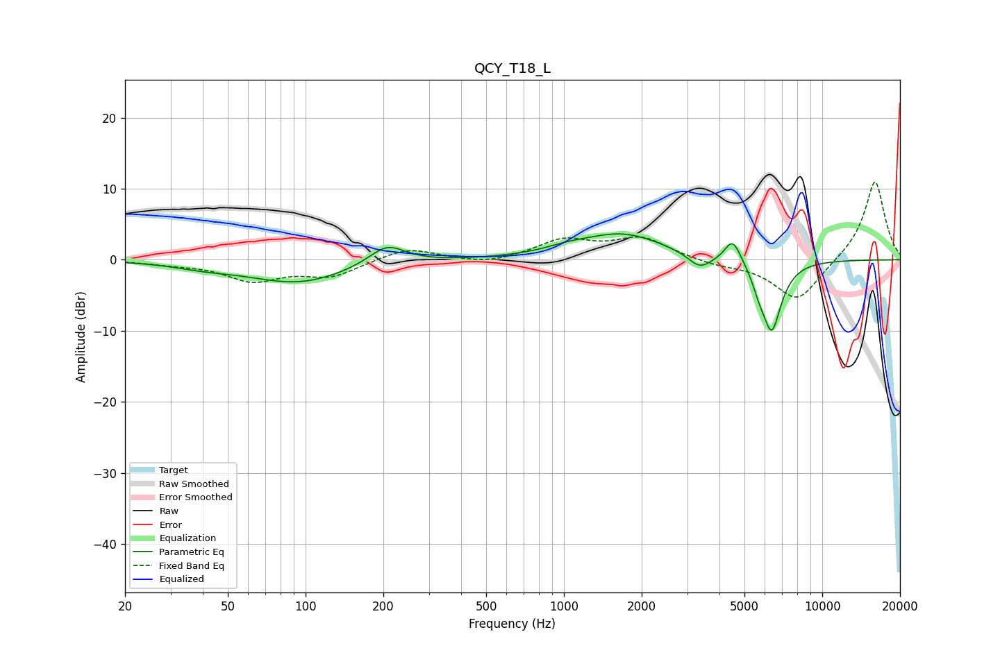

# QCY_T18_L
See [usage instructions](https://github.com/jaakkopasanen/AutoEq#usage) for more options and info.

### Parametric EQs
Apply preamp of -3.7 dB when using parametric equalizer.

|   # | Type    |   Fc (Hz) |    Q |   Gain (dB) |
|-----|---------|-----------|------|-------------|
|   1 | Peaking |        41 | 1.2  |        -0.6 |
|   2 | Peaking |        94 | 0.74 |        -3.2 |
|   3 | Peaking |       207 | 1.97 |         2.8 |
|   4 | Peaking |      1021 | 1.68 |         0.6 |
|   5 | Peaking |      1680 | 0.87 |         3.6 |
|   6 | Peaking |      3356 | 3.11 |        -2   |
|   7 | Peaking |      4478 | 4.79 |         2.7 |
|   8 | Peaking |      4692 | 3.8  |         0.8 |
|   9 | Peaking |      5677 | 5.99 |        -1.5 |
|  10 | Peaking |      6367 | 3.51 |       -10   |

### Fixed Band EQs
When using fixed band (also called graphic) equalizer, apply preamp of **-11.0 dB** (if available) and set gains manually with these parameters.

|   # | Type    |   Fc (Hz) |    Q |   Gain (dB) |
|-----|---------|-----------|------|-------------|
|   1 | Peaking |        31 | 1.41 |        -0.4 |
|   2 | Peaking |        62 | 1.41 |        -2.8 |
|   3 | Peaking |       125 | 1.41 |        -2.2 |
|   4 | Peaking |       250 | 1.41 |         1.8 |
|   5 | Peaking |       500 | 1.41 |        -0.7 |
|   6 | Peaking |      1000 | 1.41 |         2.6 |
|   7 | Peaking |      2000 | 1.41 |         3   |
|   8 | Peaking |      4000 | 1.41 |        -0.7 |
|   9 | Peaking |      8000 | 1.41 |        -5.9 |
|  10 | Peaking |     16000 | 1.41 |        11.3 |

### Graphs

