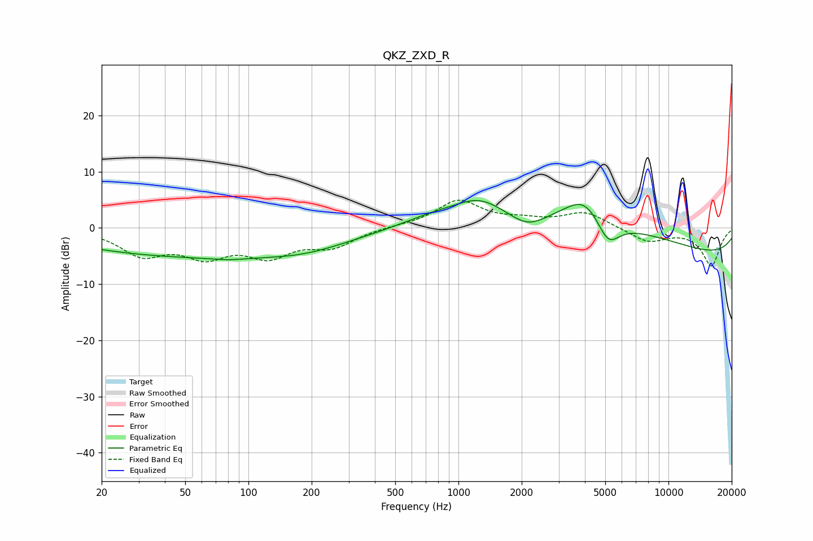

# QKZ_ZXD_R
See [usage instructions](https://github.com/jaakkopasanen/AutoEq#usage) for more options and info.

### Parametric EQs
Apply preamp of -5.0 dB when using parametric equalizer.

|   # | Type    |   Fc (Hz) |    Q |   Gain (dB) |
|-----|---------|-----------|------|-------------|
|   1 | Peaking |        60 | 0.21 |        -5.1 |
|   2 | Peaking |        80 | 1.83 |        -0.4 |
|   3 | Peaking |       186 | 0.79 |        -1.1 |
|   4 | Peaking |       766 | 0.86 |         1.6 |
|   5 | Peaking |      1252 | 1.29 |         3   |
|   6 | Peaking |      2134 | 1.63 |        -2.7 |
|   7 | Peaking |      3986 | 1.52 |         4.7 |
|   8 | Peaking |      4005 | 0.29 |         5.6 |
|   9 | Peaking |      5159 | 2.54 |        -4.8 |
|  10 | Peaking |     10000 | 0.18 |        -5.8 |

### Fixed Band EQs
When using fixed band (also called graphic) equalizer, apply preamp of **-5.0 dB** (if available) and set gains manually with these parameters.

|   # | Type    |   Fc (Hz) |    Q |   Gain (dB) |
|-----|---------|-----------|------|-------------|
|   1 | Peaking |        31 | 1.41 |        -4.4 |
|   2 | Peaking |        62 | 1.41 |        -4.3 |
|   3 | Peaking |       125 | 1.41 |        -4.4 |
|   4 | Peaking |       250 | 1.41 |        -3   |
|   5 | Peaking |       500 | 1.41 |         0.2 |
|   6 | Peaking |      1000 | 1.41 |         4.8 |
|   7 | Peaking |      2000 | 1.41 |         1   |
|   8 | Peaking |      4000 | 1.41 |         2.8 |
|   9 | Peaking |      8000 | 1.41 |        -2.5 |
|  10 | Peaking |     16000 | 1.41 |        -6.7 |

### Graphs

