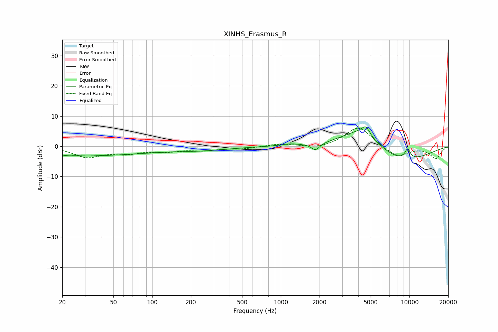

# XINHS_Erasmus_R
See [usage instructions](https://github.com/jaakkopasanen/AutoEq#usage) for more options and info.

### Parametric EQs
Apply preamp of -6.6 dB when using parametric equalizer.

|   # | Type    |   Fc (Hz) |    Q |   Gain (dB) |
|-----|---------|-----------|------|-------------|
|   1 | Peaking |        24 | 1.48 |        -2.9 |
|   2 | Peaking |        25 | 2.05 |         1.8 |
|   3 | Peaking |        46 | 0.41 |        -2.5 |
|   4 | Peaking |       239 | 0.64 |        -1.1 |
|   5 | Peaking |      1174 | 2.02 |         0.6 |
|   6 | Peaking |      1861 | 4.39 |        -2.4 |
|   7 | Peaking |      4214 | 0.9  |         7.2 |
|   8 | Peaking |      4577 | 4.61 |         2.9 |
|   9 | Peaking |      8418 | 0.56 |        -6   |
|  10 | Peaking |      9675 | 5.65 |         3.4 |

### Fixed Band EQs
When using fixed band (also called graphic) equalizer, apply preamp of **-6.1 dB** (if available) and set gains manually with these parameters.

|   # | Type    |   Fc (Hz) |    Q |   Gain (dB) |
|-----|---------|-----------|------|-------------|
|   1 | Peaking |        31 | 1.41 |        -3.4 |
|   2 | Peaking |        62 | 1.41 |        -2   |
|   3 | Peaking |       125 | 1.41 |        -1.5 |
|   4 | Peaking |       250 | 1.41 |        -1.1 |
|   5 | Peaking |       500 | 1.41 |        -0.7 |
|   6 | Peaking |      1000 | 1.41 |         0.8 |
|   7 | Peaking |      2000 | 1.41 |        -0.9 |
|   8 | Peaking |      4000 | 1.41 |         6.7 |
|   9 | Peaking |      8000 | 1.41 |        -3.7 |
|  10 | Peaking |     16000 | 1.41 |        -4   |

### Graphs

