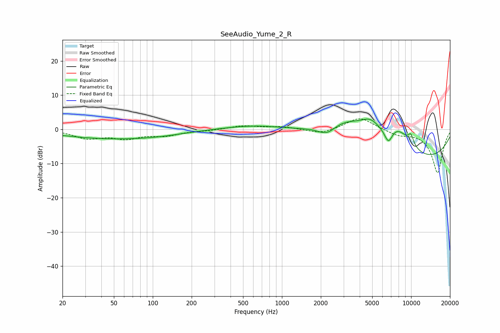

# SeeAudio_Yume_2_R
See [usage instructions](https://github.com/jaakkopasanen/AutoEq#usage) for more options and info.

### Parametric EQs
Apply preamp of -3.1 dB when using parametric equalizer.

|   # | Type    |   Fc (Hz) |    Q |   Gain (dB) |
|-----|---------|-----------|------|-------------|
|   1 | Peaking |        47 | 0.36 |        -2.6 |
|   2 | Peaking |       116 | 0.66 |        -0.6 |
|   3 | Peaking |       656 | 0.58 |         1.5 |
|   4 | Peaking |      2230 | 1.96 |        -3.1 |
|   5 | Peaking |      3101 | 0.58 |        10.5 |
|   6 | Peaking |      4837 | 1.88 |         3.7 |
|   7 | Peaking |      6680 | 4.18 |        -4.5 |
|   8 | Peaking |      7513 | 0.2  |       -11.8 |
|   9 | Peaking |      7731 | 1.09 |         8   |
|  10 | Peaking |      9967 | 5.86 |         2.9 |

### Fixed Band EQs
When using fixed band (also called graphic) equalizer, apply preamp of **-3.2 dB** (if available) and set gains manually with these parameters.

|   # | Type    |   Fc (Hz) |    Q |   Gain (dB) |
|-----|---------|-----------|------|-------------|
|   1 | Peaking |        31 | 1.41 |        -2.4 |
|   2 | Peaking |        62 | 1.41 |        -2.3 |
|   3 | Peaking |       125 | 1.41 |        -1.6 |
|   4 | Peaking |       250 | 1.41 |        -0.3 |
|   5 | Peaking |       500 | 1.41 |         1   |
|   6 | Peaking |      1000 | 1.41 |         0.8 |
|   7 | Peaking |      2000 | 1.41 |        -1.4 |
|   8 | Peaking |      4000 | 1.41 |         3.7 |
|   9 | Peaking |      8000 | 1.41 |        -1.5 |
|  10 | Peaking |     16000 | 1.41 |       -12.7 |

### Graphs

