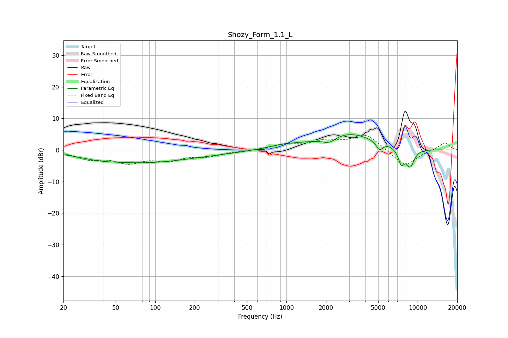

# Shozy_Form_1.1_L
See [usage instructions](https://github.com/jaakkopasanen/AutoEq#usage) for more options and info.

### Parametric EQs
Apply preamp of -5.0 dB when using parametric equalizer.

|   # | Type    |   Fc (Hz) |    Q |   Gain (dB) |
|-----|---------|-----------|------|-------------|
|   1 | Peaking |        37 | 1.08 |        -0.8 |
|   2 | Peaking |        82 | 0.38 |        -3.8 |
|   3 | Peaking |       598 | 0.43 |        -0.7 |
|   4 | Peaking |       992 | 0.78 |         1.8 |
|   5 | Peaking |      2116 | 2.8  |        -1.8 |
|   6 | Peaking |      3021 | 0.74 |         5.1 |
|   7 | Peaking |      5120 | 5.89 |        -2.5 |
|   8 | Peaking |      6045 | 6    |         0.2 |
|   9 | Peaking |      7511 | 5.48 |        -4.6 |
|  10 | Peaking |      8781 | 4.03 |        -5.5 |

### Fixed Band EQs
When using fixed band (also called graphic) equalizer, apply preamp of **-4.8 dB** (if available) and set gains manually with these parameters.

|   # | Type    |   Fc (Hz) |    Q |   Gain (dB) |
|-----|---------|-----------|------|-------------|
|   1 | Peaking |        31 | 1.41 |        -2.5 |
|   2 | Peaking |        62 | 1.41 |        -3.5 |
|   3 | Peaking |       125 | 1.41 |        -2.8 |
|   4 | Peaking |       250 | 1.41 |        -1.7 |
|   5 | Peaking |       500 | 1.41 |        -0.2 |
|   6 | Peaking |      1000 | 1.41 |         1.6 |
|   7 | Peaking |      2000 | 1.41 |         2.4 |
|   8 | Peaking |      4000 | 1.41 |         4.9 |
|   9 | Peaking |      8000 | 1.41 |        -5.3 |
|  10 | Peaking |     16000 | 1.41 |         2.5 |

### Graphs

