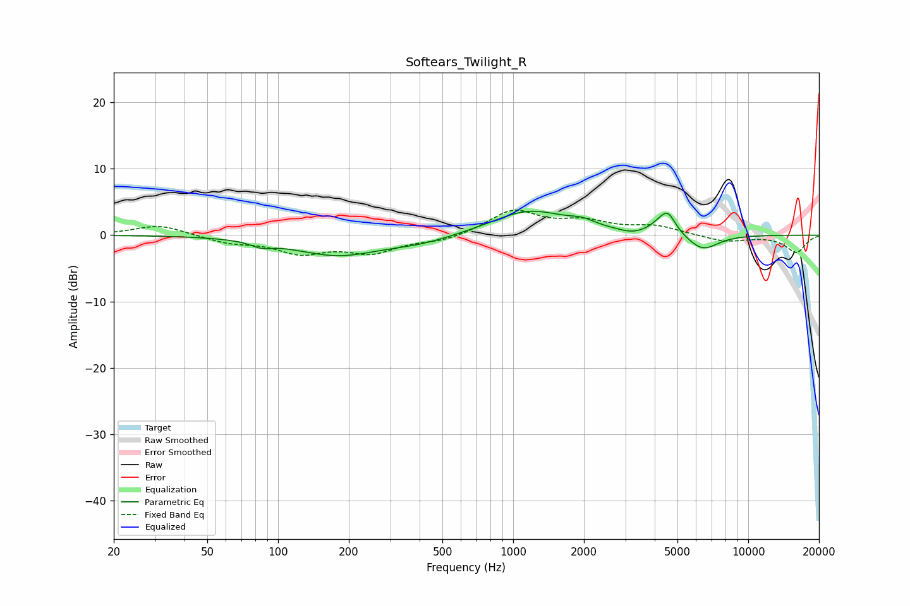

# Softears_Twilight_R
See [usage instructions](https://github.com/jaakkopasanen/AutoEq#usage) for more options and info.

### Parametric EQs
Apply preamp of -3.7 dB when using parametric equalizer.

|   # | Type    |   Fc (Hz) |    Q |   Gain (dB) |
|-----|---------|-----------|------|-------------|
|   1 | Peaking |        85 | 3.23 |        -0.8 |
|   2 | Peaking |       150 | 1.88 |         0.1 |
|   3 | Peaking |       176 | 0.78 |        -3   |
|   4 | Peaking |       405 | 0.95 |        -1   |
|   5 | Peaking |      1168 | 0.89 |         3.7 |
|   6 | Peaking |      1976 | 2.44 |         0.9 |
|   7 | Peaking |      3202 | 3    |        -0.4 |
|   8 | Peaking |      4152 | 3.48 |         0.9 |
|   9 | Peaking |      4552 | 4.07 |         3   |
|  10 | Peaking |      6409 | 2.1  |        -2.4 |

### Fixed Band EQs
When using fixed band (also called graphic) equalizer, apply preamp of **-3.9 dB** (if available) and set gains manually with these parameters.

|   # | Type    |   Fc (Hz) |    Q |   Gain (dB) |
|-----|---------|-----------|------|-------------|
|   1 | Peaking |        31 | 1.41 |         1.6 |
|   2 | Peaking |        62 | 1.41 |        -1   |
|   3 | Peaking |       125 | 1.41 |        -2.5 |
|   4 | Peaking |       250 | 1.41 |        -2.4 |
|   5 | Peaking |       500 | 1.41 |        -0.9 |
|   6 | Peaking |      1000 | 1.41 |         3.6 |
|   7 | Peaking |      2000 | 1.41 |         1.8 |
|   8 | Peaking |      4000 | 1.41 |         1.3 |
|   9 | Peaking |      8000 | 1.41 |        -1   |
|  10 | Peaking |     16000 | 1.41 |        -2.6 |

### Graphs

