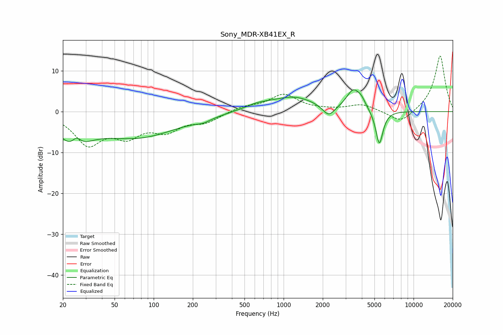

# Sony_MDR-XB41EX_R
See [usage instructions](https://github.com/jaakkopasanen/AutoEq#usage) for more options and info.

### Parametric EQs
Apply preamp of -5.4 dB when using parametric equalizer.

|   # | Type    |   Fc (Hz) |    Q |   Gain (dB) |
|-----|---------|-----------|------|-------------|
|   1 | Peaking |        24 | 1.29 |        -6.9 |
|   2 | Peaking |        26 | 3.95 |         2.8 |
|   3 | Peaking |        76 | 0.45 |        -6   |
|   4 | Peaking |       241 | 2.39 |        -0.8 |
|   5 | Peaking |       625 | 1.4  |         1.2 |
|   6 | Peaking |      1193 | 0.83 |         3.5 |
|   7 | Peaking |      2222 | 3.06 |        -2.8 |
|   8 | Peaking |      3423 | 2.71 |         4.7 |
|   9 | Peaking |      3955 | 4.05 |         1.7 |
|  10 | Peaking |      5451 | 4.9  |        -8.6 |

### Fixed Band EQs
When using fixed band (also called graphic) equalizer, apply preamp of **-13.7 dB** (if available) and set gains manually with these parameters.

|   # | Type    |   Fc (Hz) |    Q |   Gain (dB) |
|-----|---------|-----------|------|-------------|
|   1 | Peaking |        31 | 1.41 |        -7.6 |
|   2 | Peaking |        62 | 1.41 |        -5   |
|   3 | Peaking |       125 | 1.41 |        -4   |
|   4 | Peaking |       250 | 1.41 |        -2.3 |
|   5 | Peaking |       500 | 1.41 |         1.1 |
|   6 | Peaking |      1000 | 1.41 |         4.1 |
|   7 | Peaking |      2000 | 1.41 |         0.2 |
|   8 | Peaking |      4000 | 1.41 |         1.7 |
|   9 | Peaking |      8000 | 1.41 |        -3.1 |
|  10 | Peaking |     16000 | 1.41 |        13.8 |

### Graphs

