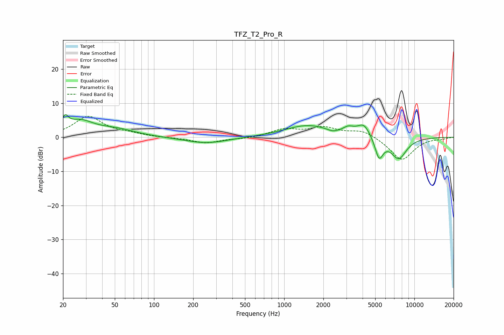

# TFZ_T2_Pro_R
See [usage instructions](https://github.com/jaakkopasanen/AutoEq#usage) for more options and info.

### Parametric EQs
Apply preamp of -6.7 dB when using parametric equalizer.

|   # | Type    |   Fc (Hz) |    Q |   Gain (dB) |
|-----|---------|-----------|------|-------------|
|   1 | Peaking |        21 | 5.79 |         3.3 |
|   2 | Peaking |        27 | 1.33 |         4.2 |
|   3 | Peaking |        51 | 0.94 |         2   |
|   4 | Peaking |       252 | 0.87 |        -1.8 |
|   5 | Peaking |      1519 | 0.8  |         3.5 |
|   6 | Peaking |      2347 | 3.44 |        -0.7 |
|   7 | Peaking |      3116 | 3.55 |         1.5 |
|   8 | Peaking |      4089 | 2.71 |         3.8 |
|   9 | Peaking |      5353 | 4.33 |        -6.1 |
|  10 | Peaking |      7569 | 2.14 |        -6.2 |

### Fixed Band EQs
When using fixed band (also called graphic) equalizer, apply preamp of **-6.2 dB** (if available) and set gains manually with these parameters.

|   # | Type    |   Fc (Hz) |    Q |   Gain (dB) |
|-----|---------|-----------|------|-------------|
|   1 | Peaking |        31 | 1.41 |         6   |
|   2 | Peaking |        62 | 1.41 |         0.8 |
|   3 | Peaking |       125 | 1.41 |        -0.1 |
|   4 | Peaking |       250 | 1.41 |        -1.7 |
|   5 | Peaking |       500 | 1.41 |        -0.4 |
|   6 | Peaking |      1000 | 1.41 |         2.2 |
|   7 | Peaking |      2000 | 1.41 |         2.6 |
|   8 | Peaking |      4000 | 1.41 |         2.1 |
|   9 | Peaking |      8000 | 1.41 |        -6.8 |
|  10 | Peaking |     16000 | 1.41 |        -0.4 |

### Graphs

