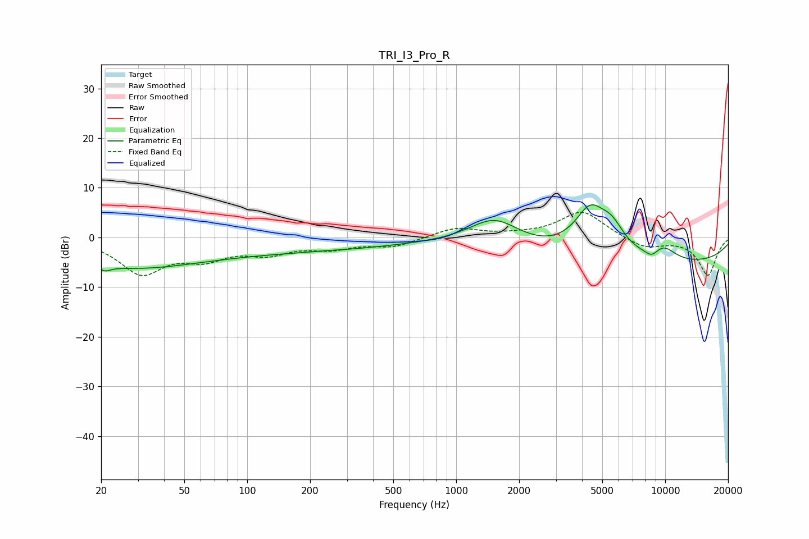

# TRI_I3_Pro_R
See [usage instructions](https://github.com/jaakkopasanen/AutoEq#usage) for more options and info.

### Parametric EQs
Apply preamp of -6.7 dB when using parametric equalizer.

|   # | Type    |   Fc (Hz) |    Q |   Gain (dB) |
|-----|---------|-----------|------|-------------|
|   1 | Peaking |        21 | 5.27 |        -1   |
|   2 | Peaking |        25 | 0.44 |        -5.1 |
|   3 | Peaking |       142 | 0.24 |        -2.6 |
|   4 | Peaking |       238 | 6    |         0.1 |
|   5 | Peaking |      1529 | 1.13 |         5.7 |
|   6 | Peaking |      4377 | 1.74 |         9.1 |
|   7 | Peaking |      5558 | 2.27 |         4.3 |
|   8 | Peaking |      8384 | 0.18 |        -5.6 |
|   9 | Peaking |      8646 | 3.95 |        -1.5 |
|  10 | Peaking |      9764 | 1.98 |         2.9 |

### Fixed Band EQs
When using fixed band (also called graphic) equalizer, apply preamp of **-5.2 dB** (if available) and set gains manually with these parameters.

|   # | Type    |   Fc (Hz) |    Q |   Gain (dB) |
|-----|---------|-----------|------|-------------|
|   1 | Peaking |        31 | 1.41 |        -6.9 |
|   2 | Peaking |        62 | 1.41 |        -3.5 |
|   3 | Peaking |       125 | 1.41 |        -2.7 |
|   4 | Peaking |       250 | 1.41 |        -1.9 |
|   5 | Peaking |       500 | 1.41 |        -1.7 |
|   6 | Peaking |      1000 | 1.41 |         2   |
|   7 | Peaking |      2000 | 1.41 |         0.3 |
|   8 | Peaking |      4000 | 1.41 |         5.3 |
|   9 | Peaking |      8000 | 1.41 |        -2.2 |
|  10 | Peaking |     16000 | 1.41 |        -7.6 |

### Graphs

