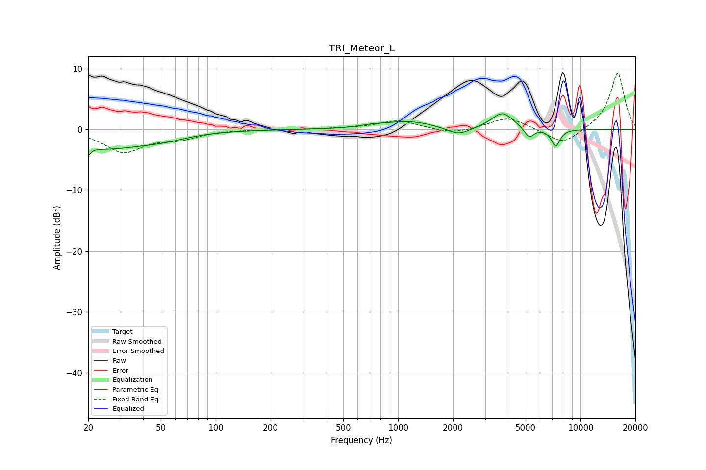

# TRI_Meteor_L
See [usage instructions](https://github.com/jaakkopasanen/AutoEq#usage) for more options and info.

### Parametric EQs
Apply preamp of -2.7 dB when using parametric equalizer.

|   # | Type    |   Fc (Hz) |    Q |   Gain (dB) |
|-----|---------|-----------|------|-------------|
|   1 | Peaking |        20 | 5.96 |        -3.7 |
|   2 | Peaking |        20 | 6    |         2.2 |
|   3 | Peaking |        25 | 0.66 |        -2.9 |
|   4 | Peaking |        52 | 1.08 |        -0.9 |
|   5 | Peaking |       714 | 2.14 |         0.3 |
|   6 | Peaking |      1137 | 1.07 |         1.3 |
|   7 | Peaking |      2143 | 2.36 |        -1.3 |
|   8 | Peaking |      3733 | 2.35 |         2.7 |
|   9 | Peaking |      5231 | 5.24 |        -1.7 |
|  10 | Peaking |      7312 | 5.52 |        -2.8 |

### Fixed Band EQs
When using fixed band (also called graphic) equalizer, apply preamp of **-9.3 dB** (if available) and set gains manually with these parameters.

|   # | Type    |   Fc (Hz) |    Q |   Gain (dB) |
|-----|---------|-----------|------|-------------|
|   1 | Peaking |        31 | 1.41 |        -3.6 |
|   2 | Peaking |        62 | 1.41 |        -1.3 |
|   3 | Peaking |       125 | 1.41 |         0   |
|   4 | Peaking |       250 | 1.41 |        -0   |
|   5 | Peaking |       500 | 1.41 |         0.1 |
|   6 | Peaking |      1000 | 1.41 |         1.5 |
|   7 | Peaking |      2000 | 1.41 |        -0.8 |
|   8 | Peaking |      4000 | 1.41 |         2.1 |
|   9 | Peaking |      8000 | 1.41 |        -2.6 |
|  10 | Peaking |     16000 | 1.41 |         9.4 |

### Graphs

