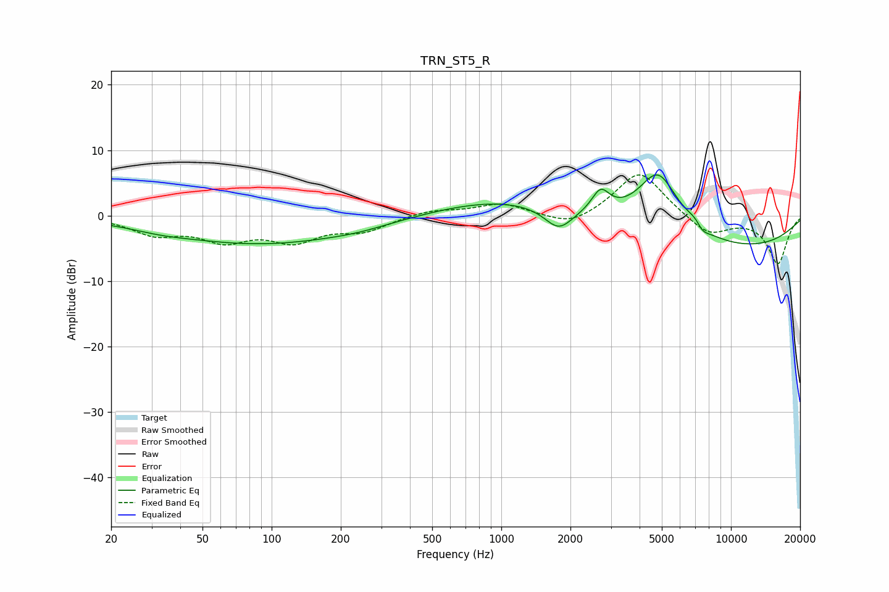

# TRN_ST5_R
See [usage instructions](https://github.com/jaakkopasanen/AutoEq#usage) for more options and info.

### Parametric EQs
Apply preamp of -6.3 dB when using parametric equalizer.

|   # | Type    |   Fc (Hz) |    Q |   Gain (dB) |
|-----|---------|-----------|------|-------------|
|   1 | Peaking |        33 | 1.21 |        -0.5 |
|   2 | Peaking |        89 | 0.35 |        -4.2 |
|   3 | Peaking |       240 | 1.02 |        -0.5 |
|   4 | Peaking |       998 | 0.49 |         2.5 |
|   5 | Peaking |      1778 | 2.3  |        -3.4 |
|   6 | Peaking |      2707 | 3.67 |         3.4 |
|   7 | Peaking |      4819 | 1.51 |         9.3 |
|   8 | Peaking |      7181 | 3.77 |         2.6 |
|   9 | Peaking |      7386 | 4.17 |        -2.6 |
|  10 | Peaking |     10000 | 0.31 |        -5.1 |

### Fixed Band EQs
When using fixed band (also called graphic) equalizer, apply preamp of **-6.3 dB** (if available) and set gains manually with these parameters.

|   # | Type    |   Fc (Hz) |    Q |   Gain (dB) |
|-----|---------|-----------|------|-------------|
|   1 | Peaking |        31 | 1.41 |        -2.6 |
|   2 | Peaking |        62 | 1.41 |        -3.3 |
|   3 | Peaking |       125 | 1.41 |        -3.4 |
|   4 | Peaking |       250 | 1.41 |        -2.1 |
|   5 | Peaking |       500 | 1.41 |         0.9 |
|   6 | Peaking |      1000 | 1.41 |         1.8 |
|   7 | Peaking |      2000 | 1.41 |        -1.9 |
|   8 | Peaking |      4000 | 1.41 |         7   |
|   9 | Peaking |      8000 | 1.41 |        -3.1 |
|  10 | Peaking |     16000 | 1.41 |        -7.3 |

### Graphs

