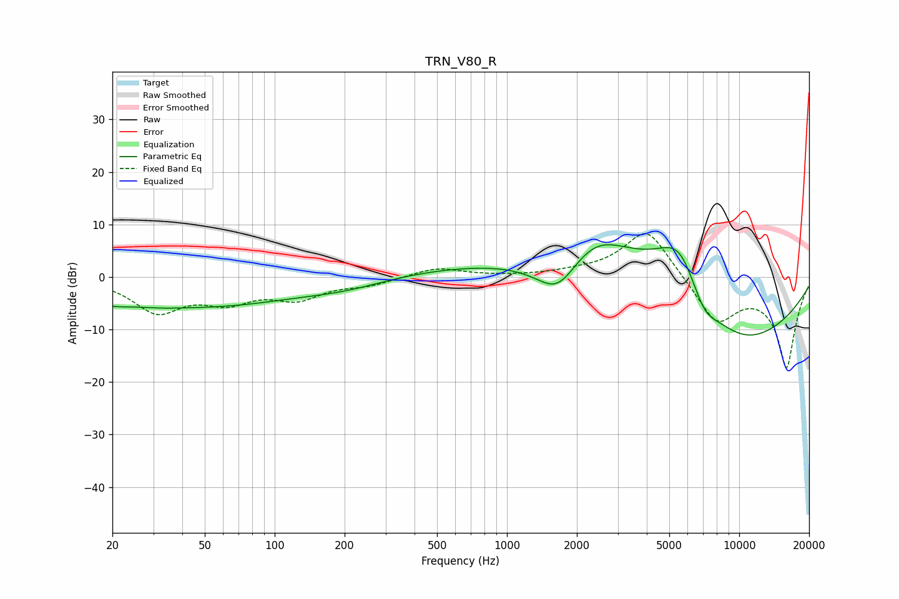

# TRN_V80_R
See [usage instructions](https://github.com/jaakkopasanen/AutoEq#usage) for more options and info.

### Parametric EQs
Apply preamp of -6.2 dB when using parametric equalizer.

|   # | Type    |   Fc (Hz) |    Q |   Gain (dB) |
|-----|---------|-----------|------|-------------|
|   1 | Peaking |        21 | 0.72 |        -4.7 |
|   2 | Peaking |        24 | 1.45 |         1.2 |
|   3 | Peaking |        64 | 0.43 |        -4.4 |
|   4 | Peaking |       203 | 0.77 |        -1.5 |
|   5 | Peaking |      1658 | 1.36 |        -8.6 |
|   6 | Peaking |      1710 | 0.19 |         2.7 |
|   7 | Peaking |      2359 | 0.84 |         9   |
|   8 | Peaking |      5539 | 1.08 |        13.7 |
|   9 | Peaking |      7027 | 2.26 |        -4.5 |
|  10 | Peaking |      9401 | 0.38 |       -15.4 |

### Fixed Band EQs
When using fixed band (also called graphic) equalizer, apply preamp of **-8.3 dB** (if available) and set gains manually with these parameters.

|   # | Type    |   Fc (Hz) |    Q |   Gain (dB) |
|-----|---------|-----------|------|-------------|
|   1 | Peaking |        31 | 1.41 |        -6.3 |
|   2 | Peaking |        62 | 1.41 |        -3.9 |
|   3 | Peaking |       125 | 1.41 |        -3.6 |
|   4 | Peaking |       250 | 1.41 |        -1.3 |
|   5 | Peaking |       500 | 1.41 |         1.8 |
|   6 | Peaking |      1000 | 1.41 |         0.1 |
|   7 | Peaking |      2000 | 1.41 |         0.6 |
|   8 | Peaking |      4000 | 1.41 |         9.7 |
|   9 | Peaking |      8000 | 1.41 |        -8.6 |
|  10 | Peaking |     16000 | 1.41 |       -17   |

### Graphs

